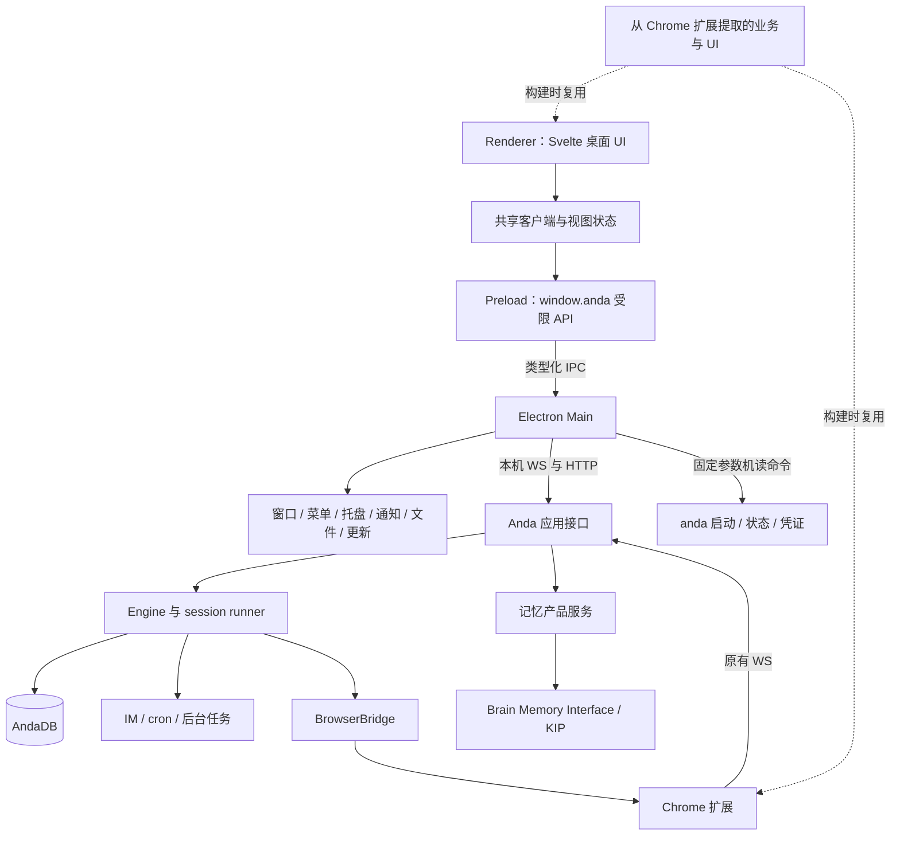

# Anda Bot 桌面客户端技术方案

调研及本次更新日期：2026-09-26。状态：已交付 Electron 首版，并继续实现协议、浏览器、终端、Git、音频自检与更新协调；实际范围与验证见[实施记录](desktop-client-implementation.md)，原后续规划见[第 10 节](#10-首版之后的实施范围与验收边界)，最新落地范围见[第 11 节](#11-后续工作台的落地状态)。下文保留设计依据和完整演进路线，不表示所有路线项均已实现。

**确定采用 Electron + Svelte 5 + TypeScript，继续使用独立的 Rust Anda daemon。整个桌面 UI/UX 以 Codex 为主要参考，覆盖布局、导航、聊天、输入、审批、工作面板、设置和系统交互。** 本文是该决定下的实施方案，不再保留 Tauri 对照选型或回退路线。

**现有主要客户端是 `chrome-extension`，它是桌面端的功能、前端代码和行为测试基线。** 三个参考各有明确职责：Chrome 扩展提供可复用的产品能力与实现，Codex 提供桌面视觉及交互参考，Anda daemon 提供运行时与数据合同。TUI 是兼容性检查对象，不是桌面客户端的产品或前端实现基线。

选型依据有两部分：本机 Codex 安装包已确认使用 Electron；用户在此前 anda-app 的 Tauri 开发中遇到较多细节及系统集成问题。后者是本项目已有实践反馈，不推导为对所有 Tauri 应用的评价。Anda 桌面优先保证完整的系统集成和交互质量，接受 Electron 的运行时分发成本。

产品采用 Anda 自有品牌、内容和记忆能力；Codex 是整体交互参考。当前首版已交付 macOS ARM64 聊天工作台；Windows 已有打包配置，尚未完成原生构建与实机验收，Linux 后续支持。内嵌浏览器、交互终端和 Git 工作区能力沿用同一工作台设计，分阶段接入。

## 1. 调研范围与结论依据

### 1.1 本次实际检查的版本

| 对象 | 基线 | 范围 |
| --- | --- | --- |
| Codex | `e72da2b53805894878023d01949a25a082e0a5cb`，本地工作树无改动 | CLI 桌面启动入口、app-server、transport、protocol、client、daemon、thread-store、worktree |
| Anda Bot | `main`，`89faa4c6861abfc338e1845503c1e23d4fb6ed2e` | daemon、gateway、browser WS、session runner、会话/审批/记忆接口、launcher、Svelte 客户端、发布流程 |

Anda 的 `Cargo.toml`、`Cargo.lock` 在开始时已有用户改动，其中工作树中的 Brain 本地 patch 已注释。依赖判断以当前工作树为准，不沿用旧文档中的未发布状态推断；本次未修改依赖、未验证 registry 可用性。

本次是源码和文档调研，没有构建 Codex、运行桌面原型、测量包体/内存，或执行真实模型任务。下文将源码事实、设计建议、待验证项分开说明。

### 1.2 Codex 源码的边界

指定仓库的根目录、pnpm workspace 和全部 `package.json` 中，未发现完整 Electron/Tauri 桌面 UI 工程。`codex app` 的代码负责找到或下载桌面应用，再通过系统方式打开；这不能用于判断桌面 UI 的实现框架。

因此，从指定源码可以验证 Codex 的应用服务协议和运行时组织方式，不能声称已经研究了它的桌面组件、窗口布局、渲染性能或全部桌面更新实现。

随后对本机已安装应用进行了只读元数据核验：路径是 [ChatGPT.app 的 Info.plist](/Applications/ChatGPT.app/Contents/Info.plist)，bundle ID 为 `com.openai.codex`，版本为 `26.924.20706`。[app.asar](/Applications/ChatGPT.app/Contents/Resources/app.asar) 内的根 package manifest 给出：

```text
name: openai-codex-electron
productName: Codex
main: .vite/build/early-bootstrap.js
devDependencies.electron: 42.3.0
devDependencies.@electron-forge/cli: ^7.11.2
devDependencies.@electron-forge/plugin-vite: ^7.11.2
```

这能确认该已安装版本的 Electron 技术路线；没有据此确认它使用 React、Svelte 或其他 UI 框架，也不把安装包元数据等同于桌面源码调研。应用包仅检查身份与构建元数据，没有修改、启动或提取整套应用代码。

### 1.3 Codex 中可以直接借鉴的设计

| 设计 | 源码事实 | 对 Anda 的启示 |
| --- | --- | --- |
| UI 与运行时分离 | app-server 提供应用接口，CLI 的桌面入口另行打开应用 | 桌面窗口消费 daemon 能力，Agent/Brain/cron 不进入 WebView |
| 类型化协议 | Rust 定义请求、响应、服务端请求、通知，并导出 TypeScript / JSON Schema | 新客户端协议以 Rust DTO 为单一来源；补协议 fixture，减少手写 TS 漂移 |
| 初始化与能力声明 | `initialize` 接收 clientInfo、capabilities，未初始化请求会被拒绝 | 建立连接后先判断版本和功能，不能假设 UI 与 daemon 永远同时升级 |
| Thread / Turn / Item | 会话、执行回合、消息/工具项有各自类型和事件 | UI 应展示结构化状态；Anda 保留自己的 session/conversation 语义，不机械换名 |
| 双向交互 | 命令审批、文件修改审批、用户输入是服务端请求；另有 resolved 通知 | 审批卡有明确身份、目标和生命周期，多客户端解析同一结果 |
| 按资源协调并发 | 请求队列按 thread、process、全局资源等范围组织 | 同一聊天的提交/停止/切换需要协调，不应把所有请求塞进一个全局串行队列 |
| 传输与业务分层 | 支持 stdio、Unix socket、WebSocket；in-process client 使用 typed channels | 业务语义不绑定某种 socket；Anda 首版复用 WS 即可 |
| 历史与实时视图分离 | ThreadStore 管历史与元数据，LocalThreadStore 使用 JSONL 和 SQLite | 学习职责划分，Anda 继续使用 AndaDB，不为桌面复制一套聊天数据库 |
| 生命周期可机读 | app-server daemon 有 JSON 输出、启动锁和 readiness 检查 | 复用 Anda 的 JSON 状态命令，补实例和协议信息，避免解析终端文案 |

Codex 的 app-server-daemon README 将该管理流程标为实验性，并主要描述 SSH/远程管理场景，不能把它直接当成已验证的本地桌面部署模板。官方 App Server 文档也描述了初始化、会话/回合、通知和审批流程，可用于交叉核对：[Codex App Server](https://learn.chatgpt.com/docs/app-server)。

### 1.4 关键源码索引

下面的路径指向本次调研的本地文件；行号对应上述基线。

| 编号 | 文件 | 核对内容 |
| --- | --- | --- |
| C1 | [Codex app_cmd.rs](/Users/zensh/git/github.com/ldclabs/claws/codex/codex-rs/cli/src/app_cmd.rs:15)、[desktop_app/mac.rs](/Users/zensh/git/github.com/ldclabs/claws/codex/codex-rs/cli/src/desktop_app/mac.rs:15) | 打开/安装桌面应用，应用签名检查 |
| C2 | [protocol/common.rs](/Users/zensh/git/github.com/ldclabs/claws/codex/codex-rs/app-server-protocol/src/protocol/common.rs:499)、[protocol/v1.rs](/Users/zensh/git/github.com/ldclabs/claws/codex/codex-rs/app-server-protocol/src/protocol/v1.rs:30) | 方法注册、初始化、能力声明 |
| C3 | [thread_data.rs](/Users/zensh/git/github.com/ldclabs/claws/codex/codex-rs/app-server-protocol/src/protocol/v2/thread_data.rs:204)、[item.rs](/Users/zensh/git/github.com/ldclabs/claws/codex/codex-rs/app-server-protocol/src/protocol/v2/item.rs:236) | Thread/Turn/Item 数据模型 |
| C4 | [export.rs](/Users/zensh/git/github.com/ldclabs/claws/codex/codex-rs/app-server-protocol/src/export.rs:123) | TS / JSON Schema 生成 |
| C5 | [transport/mod.rs](/Users/zensh/git/github.com/ldclabs/claws/codex/codex-rs/app-server-transport/src/transport/mod.rs:94)、[app-server-client README](/Users/zensh/git/github.com/ldclabs/claws/codex/codex-rs/app-server-client/README.md:1) | 外部传输、进程内传输和关闭 |
| C6 | [request_serialization.rs](/Users/zensh/git/github.com/ldclabs/claws/codex/codex-rs/app-server/src/request_serialization.rs:25)、[thread_state.rs](/Users/zensh/git/github.com/ldclabs/claws/codex/codex-rs/app-server/src/thread_state.rs:83) | 并发范围、订阅和审批状态顺序 |
| C7 | [thread-store README](/Users/zensh/git/github.com/ldclabs/claws/codex/codex-rs/thread-store/README.md:1)、[app-server-daemon README](/Users/zensh/git/github.com/ldclabs/claws/codex/codex-rs/app-server-daemon/README.md:1) | 持久化边界、daemon 生命周期 |
| C8 | [worktree/lib.rs](/Users/zensh/git/github.com/ldclabs/claws/codex/codex-rs/worktree/src/lib.rs:25) | 后续工作区隔离能力的参考 |
| A1 | [Anda daemon_protocol.rs](/Users/zensh/git/github.com/ldclabs/anda-bot/anda_bot/src/daemon_protocol.rs:1)、[launcher/core.rs](/Users/zensh/git/github.com/ldclabs/anda-bot/anda_bot/src/bin/anda_launcher/core.rs:1068) | 现有机读状态、启动/停止、更新合同 |
| A2 | [engine.rs](/Users/zensh/git/github.com/ldclabs/anda-bot/anda_bot/src/engine.rs:843)、[browser_ws.rs](/Users/zensh/git/github.com/ldclabs/anda-bot/anda_bot/src/engine/browser_ws.rs:354) | WS 路由、现有 RPC 与 HTTP 管理接口 |
| A3 | [agent.rs](/Users/zensh/git/github.com/ldclabs/anda-bot/anda_bot/src/engine/agent.rs:1209)、[agent/runner.rs](/Users/zensh/git/github.com/ldclabs/anda-bot/anda_bot/src/engine/agent/runner.rs:54) | 普通对话受理后运行独立 session task |
| A4 | [conversation.rs](/Users/zensh/git/github.com/ldclabs/anda-bot/anda_bot/src/engine/conversation.rs:25)、[action.rs](/Users/zensh/git/github.com/ldclabs/anda-bot/anda_bot/src/engine/action.rs:159)、[action/protocol.rs](/Users/zensh/git/github.com/ldclabs/anda-bot/anda_bot/src/engine/action/protocol.rs:1) | 增量查询、审批归属检查和卡片格式 |
| A5 | [client/daemon.ts](/Users/zensh/git/github.com/ldclabs/anda-bot/chrome-extension/src/lib/anda/client/daemon.ts:16)、[client/channel.svelte.ts](/Users/zensh/git/github.com/ldclabs/anda-bot/chrome-extension/src/lib/anda/client/channel.svelte.ts:36) | 客户端抽象、3 秒基础轮询间隔和续接链 |
| A6 | [client/side-panel.svelte.ts](/Users/zensh/git/github.com/ldclabs/anda-bot/chrome-extension/src/lib/anda/client/side-panel.svelte.ts:57)、[DashboardApp.svelte](/Users/zensh/git/github.com/ldclabs/anda-bot/chrome-extension/src/DashboardApp.svelte:1) | Chrome 耦合点、记忆/书签/技能/配置 UI |
| A7 | [identity/store.rs](/Users/zensh/git/github.com/ldclabs/anda-bot/anda_bot/src/identity/store.rs:7)、[main.rs](/Users/zensh/git/github.com/ldclabs/anda-bot/anda_bot/src/main.rs:791) | 身份凭证存储、现有浏览器 CWT 签发 |
| A8 | [release.yml](/Users/zensh/git/github.com/ldclabs/anda-bot/.github/workflows/release.yml:1)、[auto_update.rs](/Users/zensh/git/github.com/ldclabs/anda-bot/anda_bot/src/auto_update.rs:1) | 当前跨平台构建和更新链路 |

## 2. Anda 已有基础与实际缺口

### 2.1 可以复用的能力

- **主要客户端**：`chrome-extension` 的 Side Panel 聊天应用和 Dashboard 是桌面迁移起点；保留其已实现的功能、会话处理和测试，仅将平台接口与桌面布局分离。
- **运行时**：独立 daemon、PID 管理、配置加载、Agent session、子任务、cron、IM 通道、Brain 和资源存储。桌面关闭不应改变这些子系统的归属。
- **系统入口**：`anda_launcher` 已有 macOS/Windows 平台实现、单实例处理、配置向导、托盘、启动停止及更新状态。它是现有桌面基础，迁移时要处理共存。
- **客户端接口**：`/ws/engine/{id}` 提供 `agent_run`、`tool_call`、模型、语音、记忆及更新相关方法；`/daemon/config` 等 HTTP 端点提供管理能力。
- **聊天状态**：`conversations_api` 提供会话读取、增量、历史列表、搜索和 source 绑定。扩展已实现压缩后的 child 链续接、重连和旧状态合并。
- **交互卡片**：Chrome 扩展已经呈现 `$action`；底层协议也供 TUI/gateway 使用。桌面优先复用扩展的展示与合并逻辑，`actions_api` 继续检查 caller 和 conversation。
- **前端**：Svelte 5、TypeScript、Vite、现有样式组件、Markdown/代码/数学渲染、附件、书签、技能、记忆产品视图和配置编辑。
- **测试资产**：已有 channel、poll-conversation、voice、workspace、resources 等测试，提取共享包时应一并迁移或复用。

### 2.2 不能直接等同于完整桌面协议的部分

| 当前情况 | 桌面产品需要补的内容 |
| --- | --- |
| browser WS 使用 `{id, method, params}`，params 是位置参数，错误通常是字符串 | 稳定的版本、类型、结构化错误和能力声明；不能宣称当前线协议已是完整 JSON-RPC 2.0 |
| `capabilities` 已返回 transcription/tts 格式及基础 `desktop` 能力 | 继续增加事件、持久回执等独立能力声明，明确不可用功能及原因 |
| 对话结果主要通过增量轮询获取，基础间隔 3 秒 | 对话变化、审批、完成状态及时推送，断线后以快照恢复 |
| 普通 `agent_run` 会创建独立 session runner，但 WS 断线会取消尚在等待的 RPC task | 区分“RPC 未确认”和“任务已受理”；避免无条件重发产生第二次执行 |
| source 与 conversation、session、compaction child 有不同生命周期 | 为桌面聊天提供稳定导航身份，不把一次 conversation ID 当永久聊天 ID |
| 已通过 `UiClient` / `ClientPlatform` 复用扩展主要 UI；浏览器执行器仍依赖 Chrome API | 保留平台边界，为 Electron 实现浏览器执行器；共享包提取按实际需要进行 |
| 审批等待器当前在进程内；历史卡片可持久化 | 重连可以查询当前等待项；daemon 重启后不能仅凭历史 pending 卡恢复授权 |
| 当前模型选择操作涉及运行时共享模型状态 | 首版明确为实例级设置，不在 UI 中暗示已有独立的每聊天模型配置 |
| 已有配置写锁、备份、原子写入及 owner-only/revision 检查 | 新协议适配继续复用同一授权与条件写入合同，不另开绕过路径 |
| 已有 daemon 自动更新及 launcher 安装机制 | 新桌面包必须明确安装和更新所有权，避免两个更新器替换同一运行时 |

首版已通过平台适配接入记忆、配置等原有独立 HTTP/设置路径，并替换共享视图的 side-panel singleton 依赖。后续协议演进继续复用这些入口，不要求先把所有 UI 改成同一种客户端抽象。

### 2.3 Chrome 扩展到桌面端的具体迁移映射

| 当前实现 | 桌面端复用方式 | 需要适配的部分 |
| --- | --- | --- |
| [App.svelte](/Users/zensh/git/github.com/ldclabs/anda-bot/chrome-extension/src/App.svelte:1) | 作为聊天功能清单和交互接线基线 | Side Panel 布局换成桌面 AppShell；不直接整页复制 |
| [ChatComposer.svelte](/Users/zensh/git/github.com/ldclabs/anda-bot/chrome-extension/src/lib/anda/ChatComposer.svelte:1)、[ChatMessageItem.svelte](/Users/zensh/git/github.com/ldclabs/anda-bot/chrome-extension/src/lib/anda/ChatMessageItem.svelte:1) | 复用输入、附件、消息及卡片的内容逻辑 | 注入客户端/平台能力，按 Codex 参考调整外观与布局 |
| [side-panel.svelte.ts](/Users/zensh/git/github.com/ldclabs/anda-bot/chrome-extension/src/lib/anda/client/side-panel.svelte.ts:57)、[daemon.ts](/Users/zensh/git/github.com/ldclabs/anda-bot/chrome-extension/src/lib/anda/client/daemon.ts:16) | 以已有 `DaemonApi` 和业务 API 为抽取边界 | 拆出 Chrome storage/runtime/tab 依赖，增加 Desktop adapter |
| [channel.svelte.ts](/Users/zensh/git/github.com/ldclabs/anda-bot/chrome-extension/src/lib/anda/client/channel.svelte.ts:1)、[conversations.ts](/Users/zensh/git/github.com/ldclabs/anda-bot/chrome-extension/src/lib/anda/client/conversations.ts:1) | 复用发送、恢复、消息归一化、审批合并、compaction child 续接 | 先保留增量轮询行为，再在合同明确后接事件推送 |
| [DashboardApp.svelte](/Users/zensh/git/github.com/ldclabs/anda-bot/chrome-extension/src/DashboardApp.svelte:1)、[ConfigApp.svelte](/Users/zensh/git/github.com/ldclabs/anda-bot/chrome-extension/src/ConfigApp.svelte:1) | 复用记忆/书签/技能/配置功能及页面内部逻辑 | Dashboard 导航融入桌面侧栏，解除 singleton 和直接连接依赖 |
| [MemoryWorkspace.svelte](/Users/zensh/git/github.com/ldclabs/anda-bot/chrome-extension/src/lib/anda/memory/MemoryWorkspace.svelte:1)、[memory/api.ts](/Users/zensh/git/github.com/ldclabs/anda-bot/chrome-extension/src/lib/anda/memory/api.ts:1) | 延续现有记忆产品操作、来源与结果状态 | HTTP/设置通过 Desktop adapter，页面与详情面板重新排布 |
| [voice-session.svelte.ts](/Users/zensh/git/github.com/ldclabs/anda-bot/chrome-extension/src/lib/anda/client/voice-session.svelte.ts:1)、[service_worker.ts](/Users/zensh/git/github.com/ldclabs/anda-bot/chrome-extension/src/service_worker.ts:1) | 保留 daemon 转写/TTS 合同；扩展继续承担 Chrome 页面能力 | 浏览器页面音频、`chrome.tts`、tab/debugger 不能当桌面能力直接搬运 |
| 现有 channel/poll-conversation/voice/workspace/resources 测试 | 作为共享客户端迁移的行为回归基础 | 补 Desktop adapter 和 Electron E2E；不只测试新桌面能启动 |

后续迁移继续按扩展当前功能维护“已复用、桌面适配、浏览器专属、待实现”清单。每项都对应现有入口或代码，桌面不得静默丢掉历史续接、审批、附件、书签、技能、记忆和配置等既有能力。TUI 只验证后端变化没有破坏既有合同，不承担这份功能清单的定义。

## 3. 已确定的技术栈

| 层次 | 选择 | 责任与取舍 |
| --- | --- | --- |
| 桌面运行时 | Electron，实施时锁定经过验证的受支持稳定版本 | Chromium 渲染、窗口、菜单、托盘、通知与 OS 事件；不照抄 Codex 的版本号 |
| UI | Svelte 5 + TypeScript + 现有样式体系 | 复用业务组件和状态逻辑；重新制作 Codex 式桌面布局，保留扩展自己的布局 |
| 开发构建 | electron-vite + Vite 的 Svelte 插件 | 分别构建 main、preload、renderer，统一开发启动与热更新 |
| 安装与更新 | electron-builder + electron-updater | macOS DMG/ZIP、Windows NSIS；使用一套明确的发布/更新链 |
| Agent 运行时 | 现有 Rust `anda` 可执行文件 | daemon、Engine、Brain、IM、cron、工具和权限判定 |
| 客户端通信 | loopback WS/HTTP；renderer 经 preload IPC | 凭证与连接留在主进程，业务保持 typed API |
| 测试 | 现有 Vitest + Electron E2E + 原生 OS 验收 | 状态合同、视觉回归、真实安装与系统交互分层验证 |

Electron 的 main、renderer、preload 与 utility process 职责可见[官方进程模型](https://www.electronjs.org/docs/latest/tutorial/process-model)；electron-vite 支持这几类入口的构建与开发流程，见[项目文档](https://electron-vite.org/guide/)。版本组合必须实际验证，不能直接假设现有扩展的 Vite 版本与所有桌面插件兼容。

Codex 安装元数据使用 Electron Forge。本项目选择 electron-builder 是为了集中管理 NSIS、macOS 安装包和更新元数据；视觉/交互参考 Codex 不要求复制其构建链。Forge Vite 插件的官方文档当前仍标为 experimental；方案不同时引入 Forge 和 builder 两套打包入口。[Forge Vite 文档](https://www.electronforge.io/config/plugins/vite)、[electron-updater 文档](https://www.electron.build/docs/features/auto-update/)

暂不引入 Rust FFI、Node 原生 keyring 模块或内嵌第二套 Agent。已有身份和后台生命周期通过 `anda` 的机读命令/API 使用；确有 Electron API 缺口时，再增加范围明确、可单独测试的平台 helper。

## 4. Electron 进程架构与系统集成



### 4.1 明确各层责任

**Renderer**拥有页面、组件和展示状态。聊天正文、审批结果和任务状态以 daemon 为准；草稿、滚动位置、面板布局属于 UI。它不打开数据库、不持有 daemon bearer、不获得 Node 文件系统或进程创建能力。

**Preload**只暴露 `window.anda` 下明确的业务动作和事件订阅，不暴露 `ipcRenderer`、任意 IPC channel、`fetch(url)`、shell 或文件系统对象。传参为可序列化 DTO，订阅返回取消函数，组件卸载、窗口销毁时释放 listener。

**Main**负责窗口、托盘、菜单、原生弹窗、凭证、daemon client、导航入口、通知和更新协调。保持少量可单测模块，不运行模型和 Brain，不同步执行大文件读取、目录扫描或压缩。CPU 密集或易崩溃的预览任务需要时放 utility process；异步 I/O 不必额外开进程。

**Daemon 应用接口**是现有业务的薄适配层，处理认证、能力、DTO、订阅和受理回执。工具审批和工作区授权必须由服务端执行，不能用 renderer 的按钮状态代替授权。

**共享客户端**统一协议类型、错误映射、会话合并和分页；Desktop adapter 经 preload，Chrome adapter 经 service worker。Svelte 业务组件不导入 Electron、Node 或 Chrome API。

### 4.2 IPC 合同

建议公开以下窄接口，名称是拟议设计：

```ts
interface DesktopBridge {
  system: {
    read(): Promise<SystemView>
    chooseWorkspace(): Promise<WorkspaceSelection | null>
    revealResource(resourceId: string): Promise<void>
  }
  chats: {
    read(chatId: string): Promise<ChatSnapshot>
    submit(input: SubmitInput): Promise<SubmissionReceipt>
    interrupt(input: InterruptInput): Promise<void>
  }
  actions: {
    respond(input: ActionResponse): Promise<ActionView>
  }
  events: {
    subscribe(scope: SubscriptionScope, listener: (event: AppEvent) => void): () => void
  }
}
```

每个 main handler 校验 sender 的主 frame、所属窗口及精确应用 origin，检查参数 schema、大小和对象访问权。TypeScript 只提供编译期约束，运行时仍需验证。Rust DTO 生成的新 daemon JSON Schema/TS 类型由同一合同测试保护；仅限桌面的 IPC 类型在 `desktop-contract` 中维护。

Main 为每个 daemon 实例保持一条连接并按窗口分发事件。renderer 重载只重建订阅，不重启 daemon、不重发用户输入。新窗口先取得快照再接后续事件。文本事件可按帧合并；审批、错误和最终结果必须及时处理，不能被大附件传输挤占。

### 4.3 生命周期与实例发现

首版沿用本机 loopback WS + HTTP，读取现有配置，默认地址仍为 `127.0.0.1:8042`。Main 使用 `Authorization` header；renderer 不直接连接这个端口。不新增 stdio/UDS/named pipe 多套传输。

启动次序：获得桌面单实例锁 → 读取 home 和安装记录 → 探测 daemon 状态/身份/版本 → 必要时通过 `anda start` 启动 → 完成握手 → 加载聊天快照。UI 可先显示本地窗口和连接状态，不以白屏等待整个 Engine 初始化。

- `app.requestSingleInstanceLock()` 协调同一桌面 profile；Anda 原有 PID/锁继续协调同一 home 的 daemon。两种锁不能互相替代。
- 默认一个 Electron 实例管理一个 Anda home。自定义 home 的桌面 userData/profile 与锁隔离，通知、草稿和凭证不能跨 home 混用。
- 第二次启动和 Dock 激活恢复现有窗口；外部 URL/文件打开事件在初始化前到达时先入有界队列，ready 后处理。
- 端口占用、非预期实例、协议不兼容分别展示；不盲目杀进程，也不启动第二个 daemon 打开同一数据库。
- GUI 启动环境不等同交互 shell。复用现有 provider env/配置加载方式，避免依赖桌面进程碰巧继承终端 PATH。

| 用户动作/系统事件 | Electron 行为 | daemon 行为 |
| --- | --- | --- |
| 关闭主窗口 | 默认隐藏窗口保留托盘；偏好可调整，首次行为有提示 | 继续执行 |
| 明确退出应用 | 退出 Electron，保留恢复信息 | 默认继续；退出前说明后台任务仍在运行 |
| 停止 Anda 服务 | 显示受影响任务并执行明确停止流程 | 按既有优雅关闭语义停止 |
| renderer 崩溃 | 展示恢复入口并从快照重建 UI | 继续；不重发任务 |
| 休眠/网络变化 | 暂停无效重连，唤醒后重认证和重新同步 | 不承诺机器睡眠期间持续执行 |
| OS 关机/注销 | 尽力保存 UI 状态，禁止顺便安装更新 | OS 可能终止；下次按持久状态恢复 |

Electron 完全退出后，本版没有存活的系统通知发布器；daemon 可以继续运行，但系统通知要等桌面重新启动。关闭窗口保留托盘时可正常通知。若后续需要“退出应用也通知”，作为独立通知 helper 功能建设。

### 4.4 系统集成清单

| 能力 | Electron 实现落点 | 必须验收的细节 |
| --- | --- | --- |
| 窗口与标题栏 | `BrowserWindow`、`screen`；macOS 原生窗口按钮，Windows title bar overlay | 拖动/非拖动区、最大化/全屏、Windows Snap、缩放、多显示器断开后窗口可见 |
| 原生菜单 | `Menu`、标准 role、平台 accelerator | 撤销/重做、复制粘贴、全选、查找、关闭、设置；输入框和网页选择行为自然 |
| 托盘/Dock/任务栏 | `Tray`、平台图标和徽标 API | 深浅主题、右键菜单、重复启动无双托盘；等待输入与完成状态不抢焦点 |
| 文件与目录 | `dialog`、受限 `shell.openPath/showItemInFolder`、拖放适配 | 中文/空格/长路径、同名文件、取消选择、文件已移走、目录授权和文件大小限制 |
| 快捷键 | 窗口菜单快捷键；显式启用时才注册 `globalShortcut` | 不默认占用系统级快捷键；IME 合成文本期间不误提交 |
| 原生通知 | `Notification`，Main 去重和路由 | 点击恢复原聊天，勿扰/拒绝通知时有应用内入口；不从通知直接批准操作 |
| 深链接/文件打开 | `open-url`、`open-file`、`second-instance` | 只支持有限 `anda://` 路由和 ID；不接受任意命令、凭证或外部 URL 作为执行指令 |
| 开机启动 | `app.setLoginItemSettings` 及安装模式适配 | 用户显式选择；继承旧 launcher 的已选设置；登录启动可只驻托盘 |
| 音频与权限 | renderer 录音、`systemPreferences`、session permission handlers | macOS 麦克风用途说明、首次授权/拒绝后引导、设备切换、Windows 隐私设置 |
| 唤醒与电源 | `powerMonitor`、必要时受控 `powerSaveBlocker` | 默认不阻止睡眠；任务执行需要保持唤醒时可配置且结束后释放 |
| 主题与无障碍 | `nativeTheme`、语义 HTML、焦点管理 | 跟随系统、200% 缩放、减少动态效果、VoiceOver/Narrator 核心路径 |

Electron 提供这些 API，但各 OS 的行为仍需逐项验收；不假设框架本身消除了平台差异。实现参照 [app API](https://www.electronjs.org/docs/latest/api/app)、[BrowserWindow](https://www.electronjs.org/docs/latest/api/browser-window)、[Notifications](https://www.electronjs.org/docs/latest/api/notification)、[Deep Links](https://www.electronjs.org/docs/latest/tutorial/launch-app-from-url-in-another-app)、[systemPreferences](https://www.electronjs.org/docs/latest/api/system-preferences)。

### 4.5 目录与依赖边界

以下为目标目录示意，并非当前目录清单。首版共享源码仍在 `chrome-extension`，IPC 合同位于 `desktop/src/shared/contract.ts`；Main 先按实际职责拆分，后续按工作包演进：

```text
desktop/
  src/main/
    index.ts                 启动、单实例和退出编排
    windows.ts               主窗口、恢复和面板宿主
    daemon-client.ts         WS/HTTP、认证、重连与能力
    daemon-manager.ts        安装发现与固定参数生命周期命令
    ipc.ts                   sender/schema 校验及业务 handler
    system-integration.ts    菜单、托盘、通知和打开事件
    updater.ts               安装责任、任务排空、更新恢复
  src/preload/index.ts       window.anda 最小 bridge
  src/renderer/              AppShell、页面和 Desktop adapter
  resources/                 图标、原生元数据、runtime 清单
  electron.vite.config.ts
  electron-builder.yml
  package.json
packages/
  anda-client/               协议类型、业务 API、状态合并及原有测试
  anda-ui/                   共用 Svelte 组件、设计 token、本地化
  desktop-contract/         Main/Preload/Renderer 的 IPC 类型与验证
anda_bot/src/app_api/
  mod.rs                    认证与分发
  protocol.rs               应用 DTO、能力与错误
  events.rs                 快照水位和有界订阅
  submissions.rs            提交回执及不确定结果对账
```

`desktop` 已加入 pnpm workspace；`packages/*` 待实际提取共享包时加入。本方案不新增 Tauri Rust 包；CLI/daemon 继续由现有 Cargo workspace 构建，Rust 新依赖仍在根 `Cargo.toml` 管理。拟议 `app_api` 留在 `anda_bot` 包内，避免为了桌面将整个 Engine 改成 Node addon 或另拆大型库。

## 5. 应用协议的渐进演进

### 5.1 兼容策略

当前本地首版：已实现 Desktop 客户端适配，连接原有 WS，复用现有增量轮询和普通聊天流程。现有扩展继续工作。

后续协议版本：新增 **拟议端点 `/ws/app/v1`**，使用标准 JSON-RPC 2.0 envelope、命名参数、结构化错误。它与旧入口共用业务实现，不重写 Engine。老 endpoint 的方法名、位置参数和 `ToolResponse` wire format 保留。

优先把聊天受理、读取、订阅、审批与系统状态做成明确方法；技能、书签、记忆等已有 API 先通过受限适配复用，不一次性翻译所有工具。Desktop IPC 只暴露需要的业务方法及允许列表，不把任意 shell、任意 URL 或通用无约束 `tool_call` 暴露给页面。

### 5.2 新应用协议的建议合同

表中的新方法名是方案设计，不是仓库当前已实现的 API。

| 方法 | 用途 | 复用基础/新增内容 |
| --- | --- | --- |
| `initialize` | client 版本、协议版本、实例标识、功能集合 | 新增；连接成功不代表功能齐全 |
| `chat/list`、`chat/read` | 导航列表、历史快照、审批当前状态 | 会话与 source 查询 + 少量 UI 元数据 |
| `chat/create` | 分配稳定 chatId/source，保存可选 workspace | 新增薄元数据记录；默认第一次提交时创建 |
| `chat/metadata/update` | 重命名、归档、项目关联 | 新增；带 expectedRevision，不等同删除/停止任务 |
| `navigation/read`、`navigation/update` | 置顶、排序、读状态和分组 | caller 范围的持久偏好，条件更新 |
| `project/list`、`project/save` | 保存本地项目/目录展示信息 | 复用 workspace 授权；保存导航不自动授予权限 |
| `chat/submit` | 受理输入，返回 clientRequestId 与受理状态 | 包装 `agent_run`，增加持久提交回执 |
| `submission/read` | 查询断线时未确认的提交 | 新增；用于对账，不能简单重发 |
| `chat/steer`、`chat/interrupt` | 对指定会话执行现有控制语义 | 复用现有控制路径；加 expectedConversationId 防止作用到新会话 |
| `chat/subscribe` | 返回快照/水位并订阅变化 | 新增；不依赖前端轮询推断完成 |
| `action/respond` | 回答已存在的审批或选择项 | 复用 `actions_api` 的授权和状态转换 |
| `system/read` | daemon 状态、已加载模型、版本、运行能力 | 聚合现有 information/status/model/voice |
| `config/read`、`config/update` | 配置读取、验证、条件保存与重载结果 | 现有配置 API + owner 检查/expectedRevision |
| `automation/list`、`automation/update` | cron 列表、启停和已支持的编辑 | owner 管理适配现有 cron API，保留原 route |

初始化响应建议包含：`protocolVersion`、`daemonVersion`、`instanceId`、`capabilities`。`instanceId` 每次 daemon 启动变化，用于丢弃旧连接事件；它不是身份凭证。未知能力默认关闭，未知枚举保留兼容展示。

协议错误至少区分：未认证、无权、版本不匹配、对象不存在、状态冲突、已受理但结果未知、暂不可用。自动重试只适用于明确安全的读操作及具有已实现幂等合同的写操作。

### 5.3 身份与聊天映射

不要把 Codex 的 `threadId` 直接替换为 Anda 的 `thread`：Anda 的 `request_meta.thread` 已表示 IM 讨论空间。

建议桌面使用以下映射：

| 标识 | 含义 |
| --- | --- |
| `chatId` | UI 稳定聊天身份，归属于 authenticated caller |
| `source = desktop:<opaque-id>` | 新桌面聊天的稳定 source；同一 workspace 可拥有多个聊天 |
| `rootConversationId` / `currentConversationId` | 起始记录与当前 compaction 续接记录 |
| `sessionId` | 运行时执行会话，不作为唯一持久导航主键 |
| `route.thread` | 原始 IM thread/session，读取旧通道会话时原样保留 |
| `clientRequestId` | 单次用户提交的去重与对账键 |

新增 source 命名必须检查现有 source 校验、workspace grant、记忆来源归属和恢复逻辑。workspace 放在独立字段，由服务端规范化和授权；不能用前端传来的目录字符串证明访问权。

聊天元数据用有 schema version 的 Bot collection 存放 chatId、caller、source、标题、workspace、归档状态及根会话关联；项目和导航偏好作为独立的轻量元数据按 caller 存储。主键、索引和条件更新合同随迁移定义，不保存另一份消息正文。聊天正文仍由原 Conversations 存储；旧会话投影加载，避免批量改写历史。所有新增 u64 标识在新 JS 合同中使用十进制字符串，避免超过安全整数范围；旧协议保持兼容。

### 5.4 实时事件与恢复

推荐先实现 `chat/changed`、`action/changed`、`task/completed`、`system/changed`，在状态持久化成功后发布。事件可带增量或提醒客户端读取差量；对同一聊天维持明确顺序。

建议 envelope：`instanceId`、`subscriptionId`、`chatId`、`seq`、`revision`、`type`、`payload`。每个订阅的 seq 单调增长；revision 对应可读取的权威状态。订阅建立过程必须协调快照与事件水位，避免“先读快照再订阅”中间漏掉更新。

- 在同一聊天的协调范围内注册订阅、取得快照水位，再发送后续事件；审批变化也参与该范围，或返回各子域独立水位。
- UI 按 instance/subscription/seq 去重，发现间隙或 daemon 重启则重新获取快照。
- 队列按数量和字节数有界；慢客户端触发 `resyncRequired`，不能反向阻塞 Agent/持久化，也不能静默丢掉审批结果。
- 初版不需要持久化全部传输事件。断线后用快照、历史和提交回执恢复；如果保留小型内存 replay buffer，游标过期也走快照。
- 同一 Main 为多个窗口维护一条连接，按窗口订阅分发；事件合并节流与长列表虚拟化一起验证。

**消息变化推送不等于 token streaming。** 本次核实了 Anda runner 通过 `completion_iter` 驱动和保存状态，没有验证上游 Engine 的逐 token hook 合同。事件协议首批覆盖已保存的消息/工具/审批变化。需要打字机输出时，先验证 Engine/provider 事件，再单独增加 `textDelta` 能力和稳定 item ID；最终落库内容覆盖临时 delta。

### 5.5 不确定提交与重复执行

WS request id 只用于关联一次连接中的响应，不能作为跨连接幂等键。

`chat/submit` 应以 `(caller, chatId, clientRequestId)` 建唯一记录，保存规范化输入摘要、受理状态和关联 conversation。相同键、相同正文返回已有回执；相同键、不同正文返回冲突。

关键是消除“runner 已入队但回执未保存”的窗口：需要把稳定请求键带入持久输入/会话受理路径，或者用可恢复的提交 journal 先记录意图，再协调入队及结果关联。仅在 WS handler 外加缓存不能解决这个问题。对无法判定的崩溃窗口保留 `unknown`，查询和恢复不得再次无条件执行。

该合同只保证重复提交控制，不宣称所有外部工具副作用都具有 exactly-once 语义。当前首版只有 Main 本地提交 journal，尚无服务端持久回执；提交断线显示待确认状态，读取会话核对，禁止自动重发。

### 5.6 审批与取消

继续使用现有 `$action` payload，桌面负责呈现命令、workspace、工具、说明和选项。响应带 actionId 与目标 conversation，服务端重新检查 caller、归属、有效期和当前状态。两个窗口同时回答时，以服务端首次有效转换为准，另一端刷新已解决状态。

现有进程内 pending map 和历史消息不是同一件事。daemon 重启后应把没有活跃等待器的卡片标成过期/需重新请求；只有业务层重新核验并建立等待项后才可接受回答，不能根据旧 UI 恢复授权。

取消操作返回“已收到取消请求”不等于外部副作用已撤销。最终卡片和任务状态由运行时通知或快照确认。审批、停止和查询不能被一个长时间工具 RPC 阻塞。

## 6. 以 Codex 为参考的完整 UI/UX 规范

### 6.1 参考范围与设计原则

Codex 是整体参考对象，直接借鉴其以项目/聊天组织工作、围绕任务呈现进展、将资源放在同一工作台的方式。Anda 的 Memory、Skills、书签和自动化接入同一套导航及面板规则；不把现有浏览器扩展的窄侧栏直接放大成桌面主界面。

官方文档可核对项目/聊天、review pane 和内置浏览器的产品概念：[Projects and chats](https://learn.chatgpt.com/docs/projects)、[Code review](https://learn.chatgpt.com/docs/code-review)、[Browser](https://learn.chatgpt.com/docs/browser)。这些资料不能代替截图测量；本轮没有做 Codex 全流程视觉审查，下列布局参数和交互细节是 Anda 的实施规格，不能表述为已测得的 Codex 内部设计值。

实施时固定一个 Codex 参考版本，以同一视口记录新聊天、有历史聊天、运行中、待审批、右侧资源面板、设置和窄窗口七类状态。直接按参考迭代，不额外探索三套视觉方向。最终产物包括带日期/版本的参考截图、Anda 对应截图和差异记录；使用合成内容，避免把用户真实聊天放进回归 fixture。

### 6.2 信息架构与布局

```text
┌──────────────────────────────────────────────────────────────────────┐
│ 原生窗口控制 / 标题栏                         面板切换 / 窗口操作       │
├───────────────┬──────────────────────────────┬───────────────────────┤
│ 新聊天 / 搜索 │ 聊天标题 · 项目/目录 · 状态    │ 资源标签页            │
│               ├──────────────────────────────┤ 文件 / 来源 / 工具结果│
│ 置顶          │                              │                       │
│ 最近聊天      │ 用户消息                     │ 当前资源详情          │
│ 项目          │ 进展与可折叠工具活动          │                       │
│   项目内聊天  │ 审批 / 问题卡                │ 可关闭、可调整宽度    │
│               │ 回答与可点击产物             │                       │
│ 记忆 / 技能   │                              │                       │
│ 自动化 / 书签 ├──────────────────────────────┤                       │
│               │ 附件与上下文                 │                       │
│ 状态 / 设置   │ 多行输入 · 模型 · 权限 · 发送 │                       │
└───────────────┴──────────────────────────────┴───────────────────────┘
```

主窗口包含三个稳定区域：可折叠侧栏、主内容区、按需显示的右侧工作面板。管理页面替换主内容区，侧栏和窗口行为保持一致。首版一个主窗口；右侧标签页不等于额外 OS 窗口，也不应为每个聊天创建一个 renderer。

初始设计 token：侧栏 240 px、右面板 420 px、消息阅读宽度上限约 820 px、正文 14 px、行高约 1.6、4 px 间距基准。它们是可调整起点，按参考截图与内容密度校准。窗口缩窄时先收起右面板，再折叠侧栏，保住聊天和输入区域；不要强行压成三列。

视觉采用克制的中性色、低层级边框、明确的文字层级和紧凑控件。用户输入、助手正文、工具活动以排版和背景轻区分；避免每条消息都成为高对比大卡片。状态色用于运行、等待输入和错误，并配合文字/图标。系统字体优先，中文与英文混排验证；代码使用独立等宽字体。支持浅色、深色、跟随系统及 reduced motion。

### 6.3 侧栏、项目和聊天

- 顶部提供新聊天与搜索；置顶、最近聊天、项目内聊天使用一致行高和 hover 行为。快捷操作在 hover/focus 时出现，键盘同样可达。
- 聊天行展示标题及最重要的单一状态。未读完成、等待审批、后台运行互相区分；不在每条历史聊天上持续显示动画。
- 切换聊天立即呈现已缓存内容，然后同步；保留各聊天草稿、选区/滚动锚点、输入框高度和右侧活动标签。
- 新建项目通过原生目录选择并经 daemon 验证 workspace grant；同项目可有多个聊天。重命名、排序、置顶只改导航元数据，不授予目录权限。
- 新聊天先创建本地草稿，第一次提交时建立持久聊天关系；不因反复点击“新聊天”留下大量空白历史。需要显式保存的项目元数据独立保存。
- 归档不等于删除会话或终止任务；运行中的已归档聊天仍在活动任务入口可达。删除项目导航不删除磁盘目录。
- 搜索支持标题和已保存会话内容，分页加载；来源跳转定位到具体聊天/消息，不只打开一个聊天列表。

### 6.4 时间线、工具活动和审批

时间线由 `Message`、`ActivityGroup`、`ActionCard`、`ArtifactLink` 等结构化组件组成。工具日志默认折叠为可读进展，展开后显示命令、workspace、输出和错误；原始 JSON 仅作为详细查看入口。

| 内容 | 默认呈现 | 行为要求 |
| --- | --- | --- |
| 助手正文 | 易读的 Markdown、代码、表格、数学 | 复制、链接、代码选择正常；新片段不破坏已有选区 |
| 执行进展 | 简洁的正在做什么、已完成什么 | 不伪造百分比/耗时；无 token hook 时不模拟打字机输出 |
| 工具调用 | 摘要行 + 展开详情 | 大输出分段/按需加载，避免一次性把长日志塞入 DOM |
| 审批卡 | 明确动作、目标、影响范围、批准/拒绝 | 等待状态保持可见，回答后保留结果；重启失效明确说明 |
| 需要用户输入 | 问题、选项及文本输入 | 保留草稿，禁用重复提交，显示服务端确认结果 |
| 产物/文件 | 可点击文件卡或文本链接 | 在右侧打开；不存在/无权限/超限有独立状态 |
| 后台子任务 | 任务名、状态、最近进展、跳转 | 不把所有子任务日志无差别混进主时间线 |

用户停在底部时自动跟随新内容；上滚阅读后保持锚点，并显示“有新内容”。恢复历史、图片加载、工具展开和 compaction 续接不能把滚动位置推回底部。长历史采用分页和必要的虚拟化，稳定消息 key 不随文本增量变化；当前可编辑卡片不能因虚拟化丢失输入。

等待审批时应用保持可操作，用户可以查看其他聊天或资源；审批入口不能藏在已折叠的普通工具日志中。停止后显示“正在停止”，以服务端最终状态结束，不把按钮点击当成已取消。

### 6.5 输入区与上下文

输入区固定在聊天底部，支持多行、粘贴图片、拖放附件、可移除的附件 chip、斜杠命令和明确的发送状态。选中的项目/workspace、模型作用范围、审批模式和记忆模式在提交前可见；只有实际支持的能力才显示。

- 保留 Enter/快捷键发送偏好；Shift+Enter 换行，IME `isComposing` 期间不触发发送。
- 建议 `Cmd/Ctrl+N` 新聊天、`Cmd/Ctrl+K` 命令面板、`Cmd/Ctrl+F` 当前聊天查找、`Cmd/Ctrl+,` 设置；这些是 Anda 初始映射，可按参考及平台习惯校准。
- Escape 优先关闭弹层或取消局部选择，不直接终止后台任务。
- 已受理后草稿转成时间线中的用户消息；未确认则保留“待确认”状态和输入摘要，不能以重复发送按钮掩盖 unknown。
- 任务运行中，输入区提供运行时实际支持的“补充指令/steer”；排队发送只有持久队列合同落地后才开放，不能先做一个会丢输入的假队列。
- 模型选择当前属于实例级时明确提示影响范围；记忆 `standard/no_store/off` 延续后端对新会话与派生任务的限制。
- 添加上下文应能解释“本次会提供哪些文件/浏览器页面”；切聊天不自动带入前一个聊天的附件或浏览器会话。

### 6.6 右侧工作面板

首版提供文件只读预览、记忆来源、工具结果三类标签页，支持打开、关闭、切换和拖动调整宽度；每个聊天记录自己的标签和活动项。文本/Markdown/图片先落地，PDF 在首版发布前做单独验证；不在缺能力时放可点击的空入口。

主聊天的文件引用、记忆证据和工具产物均通过统一 `openResource` 行为进入该面板。资源标识由 daemon 授权，不能把任意路径拼进加载 URL。大文件先给摘要/下载或系统打开入口，不冻结聊天。

后续加入终端、diff、浏览器时沿用相同面板导航：

- 终端使用独立 PTY 生命周期和输入授权，复用已有 shell runtime 能力或明确扩展，不能把 UI 终端旁路到无审计执行。
- diff 优先展示可核对的变更，编辑、stage、commit 和 worktree 分别建设接口。
- 内嵌浏览器采用独立 session 的 `WebContentsView`，与应用 renderer 隔离；不使用已废弃的 BrowserView 作为新基础。原生 view 的尺寸、焦点、弹层遮挡和关闭释放需要验收。[WebContentsView](https://www.electronjs.org/docs/latest/api/web-contents-view)
- Electron 自带 Chromium 不等于能访问用户 Chrome 的标签页、登录态或扩展。已有浏览器自动化继续走 Chrome extension/BrowserBridge；内嵌浏览器自动化另建明确 adapter。

### 6.7 管理页面及能力范围

| 页面 | 首版交付 | 设计要求 |
| --- | --- | --- |
| Memory | 当前产品概览、活动、来源、记录、待办和已实现的变更流程 | 使用统一列表/详情面板；保持预览、提交、unknown 对账和能力解释 |
| Skills | 列表、搜索、详情和已有管理操作 | 来源、可用性和作用范围清楚；不引入第二套技能目录 |
| Bookmarks | 列表/搜索、跳回聊天或来源 | 复用现有数据，跳转能定位具体内容 |
| Automations | 当前 cron 任务/运行记录、启停与已验证的编辑流程 | scheduler 留在 daemon；时区、下次运行、投递目标明确 |
| Settings | 模型、语言、主题、权限、后台运行、通知、连接、更新 | 分类侧栏 + 表单；危险操作就地说明影响，不弹整屏原始配置 |
| 高级配置 | YAML 编辑、验证、差异、保存/重载结果 | `expectedRevision` 冲突检查；保存成功与模型重载成功分开表达 |

系统配置、IM 通道配置和记忆修改只开放后端已实现且授权明确的操作。未实现的集成显示原因或不出现入口，不把所有内部能力装成同样可用的按钮。

### 6.8 状态、通知与恢复规范

| 状态 | 用户看到什么 | 可采取的动作 |
| --- | --- | --- |
| daemon 连接中/离线 | 连接状态条，已加载历史仍可读 | 重连、查看诊断；本地草稿可编辑 |
| 输入已受理 | 消息进入时间线，有执行状态 | 查看进展，切换聊天 |
| 运行中 | 进展摘要与停止入口 | 补充指令、查看工具 |
| 等待输入/审批 | 突出的未解决卡片和侧栏状态 | 回答/批准/拒绝 |
| 提交结果不确定 | “发送状态待确认”，保留请求身份 | 查询回执；不自动重新执行 |
| 已完成 | 最终内容、产物、未读标记 | 阅读、继续输入 |
| 失败 | 已保留的结果及具体失败阶段 | 重试安全读操作或明确发起新任务 |
| renderer 恢复/daemon 重启 | 恢复提示，重新同步权威状态 | 恢复草稿与视图，重新确认失效审批 |

连接状态、任务状态和页面加载状态分别维护。网络断开不能把任务标成失败；聊天归档不能标成完成；用户打开通知不等于已读全部新内容。

通知默认只用于待输入、完成和需要处理的失败；当前窗口正在阅读同一聊天时抑制重复系统通知。Main 按持久对象 ID/版本去重，恢复连接后汇总未读变化，避免重播历史事件造成通知风暴。读状态在内容进入前台可见区域后推进；布局状态保存在本地，跨客户端的标题/归档/读状态由 daemon 元数据协调。

### 6.9 组件复用与迁移

本节以 `chrome-extension` 为唯一现有前端迁移来源，具体对应第 2.3 节。桌面实现不从 TUI 重建一套聊天状态，也不为了套用 Codex 的 Thread/Turn 命名替换已工作的扩展业务模型。

先提取 `DaemonApi`、业务 DTO、错误处理、conversations/commands/workspace 纯函数及测试；再把 Channel 和页面对 `AndaSidePanelClient` singleton 的依赖改为注入。桌面与扩展复用消息/审批/记忆/技能内容组件，桌面 AppShell 和扩展 SidePanelShell 分别拥有布局。

新增薄平台接口覆盖偏好存储、原生选择/打开、剪贴板、通知、音频和浏览器上下文。记忆/配置 HTTP 客户端同样经 Desktop adapter，不为复用而把 bearer 传回 renderer。保留既有语言键与多语言检查。

提取顺序以桌面真实使用为准，每次移动保持 Chrome 扩展可运行。可以先迁移一个完整聊天纵切面，再推广到 Memory/Skills；不先重构所有前端，也不复制整套业务逻辑后长期维护两份。

## 7. 身份、安全和数据边界

这些要求服务于桌面新增的本地权限入口，不代表本次完成了安全审计。

- **凭证复用**：使用现有 identity 存储和 caller 映射。过渡原型可由 Main 执行已有 `anda browser token --json`，捕获输出到内存；该 token 当前带 `chrome_extension` 标识和宽 scope，不能视为已具桌面最小权限。
- **正式凭证**：增加桌面专用签发入口和可执行的权限规则，使用短期凭证及续期；仅把 claim 改成 `desktop` 并不会自动实现权限隔离。私钥不出身份模块，bearer 不进日志、renderer 持久化、链接或进程参数。
- **实例绑定**：Main 使用可信的本地安装路径和配置发现 daemon，验证握手中的实例/home 关联；端口占用不自动接管、不盲目杀进程。不得接受 renderer 任意指定服务 URL 并附上 owner token。
- **管理授权**：现有配置 HTTP handler 已增加 owner 检查和 revision 冲突检查。后续配置、生命周期、安装更新入口继续显式限定 local owner，不能因桌面只有 owner 界面就假设所有网络入口天然 owner-only。
- **WS 鉴权**：每个请求和持续订阅投递都遵守凭证期限与授权变化。浏览器来源请求校验允许的 Origin；本机 Main 连接可无 Origin，但仍需凭证。不能用 CORS 代替 WebSocket 鉴权。
- **页面权限**：主窗口仅加载打包资源，限制 IPC command、导航和外链；Markdown/附件/工具输出视为不可信内容。远端页面或 HTML 预览使用无应用 IPC 的独立隔离表面。
- **文件访问**：文件选择后使用受限句柄/资源 ID；Main/daemon 校验规范化路径和 workspace grant。大附件避免在 IPC 中反复复制 base64；新增流式传输前保持已验证的大小上限。
- **Brain**：继续保留原 caller bearer 和 native principal 映射，不换成全局 Bot token。优先复用记忆产品层；不让桌面直接写 Brain DB，不把独立 outcomes 暴露成通用模型工具。
- **IM**：保留 `external_user` 和 `(channel, reply_target, thread)`。桌面查看通道消息不应改变身份；首版历史查看/新桌面聊天与“向原 IM 发送”分开定义，回原通道必须走已授权的原始 route。

Electron 主窗口显式使用 `contextIsolation: true`、`sandbox: true`、`nodeIntegration: false`、`webSecurity: true`，预加载脚本与这些设置保持兼容；不因某个预览组件需要 Node 就关闭隔离。生产 UI 使用受限本地协议与 CSP，禁用任意导航、新窗口和未经检查的外链；IPC handler 校验 sender，permission request/check handlers 对远程内容默认拒绝，麦克风仅在明确用户操作下按 origin 放行。[Electron Security](https://www.electronjs.org/docs/latest/tutorial/security)

Electron renderer sandbox 保护的是 UI 进程边界，并不自动限制 Rust daemon 工具的 OS 权限；现有工具执行和审批规则仍需完整保留。运行时加载入口、调试能力和 Electron fuses 在发布配置中单独检查。

短期 bearer 优先只存在 Main 内存。必须持久化的桌面秘密才使用经验证的 `safeStorage`；它不替代 Anda identity keystore，也不承诺抵御同一 OS 用户的任意恶意进程。后续 Linux 如退化到 `basic_text`，拒绝持久化秘密并给出可处理状态，不静默当作已安全加密。[safeStorage](https://www.electronjs.org/docs/latest/api/safe-storage)

## 8. 安装、daemon 所有权与更新

### 8.1 两种运行模式

| 模式 | 启动来源 | 更新责任 | 退出行为 |
| --- | --- | --- | --- |
| 附着现有安装 | 用户已有 `anda`，使用同一 home | 原安装器/daemon 更新流程；桌面只报告兼容性 | 不停止用户已有服务 |
| 桌面托管安装 | 桌面包携带匹配版本的 `anda`，由 Main 启动 | 桌面包统一协调 UI 与配套 runtime | 默认保留 daemon，停止需显式操作 |

同一 home 只有一个 daemon 实例和一个安装更新责任方。启动时先探测：运行且兼容则附着；未运行则按已记录的安装模式启动；运行但不兼容时显示升级/重启指引。不能为了让 UI 连上而启动第二份 daemon 访问同一数据库。

建议为实例和安装信息提供机读记录：home 标识、实际可执行文件、版本、协议范围、installation owner、进程身份。沿用 PID 锁并补 readiness/版本验证；PID 或端口存在本身不足以证明连到了正确实例。

### 8.2 launcher 迁移

开发期保留 `anda_launcher` 作为回退入口。正式桌面托管安装接管托盘及开机启动时，迁移原 launcher 的自动启动注册和实例锁协作，确保用户不会得到两个托盘、两个向导、两个更新提示。

不要一次删掉所有原生 launcher 代码。先复用启动命令、状态协议和必要配置逻辑；主窗口稳定、安装升级回归通过后再移除重复平台 UI。现有用户配置、身份、数据库和技能路径均保留。

### 8.3 Electron 打包与发行

使用 electron-vite 产出 main/preload/renderer，electron-builder 组装安装包。`anda` 放入 `extraResources` 管理的真实文件目录，不能放在 ASAR 中当作可直接执行文件；Main 从 `process.resourcesPath` 定位并验证安装清单。每个发行目标只打包对应架构的运行时，记录版本、hash 和支持的协议范围。具体构建/分发边界见 [electron-vite Distribution](https://electron-vite.org/guide/distribution)。

| 平台 | 首版产物 | 发布验收 |
| --- | --- | --- |
| macOS arm64 / x64 | `.dmg` + 更新所需 `.zip` | Developer ID、嵌入 Rust binary 与 Electron helpers 签名、公证、麦克风说明、Keychain 访问；Apple Silicon/Intel 分别验收 |
| Windows x64 | 每用户 NSIS installer + 更新元数据 | Authenticode、稳定 AppUserModelID、快捷方式与通知、开机启动、路径编码、更新时 binary 锁；不依赖 WebView2 |
| Linux 后续 | 按支持目标选择 AppImage / deb 等 | Chromium 运行依赖、sandbox、keyring、托盘和通知；CLI Linux 构建不等于桌面可用 |

首版只走直接分发的 NSIS/macOS 更新链；MSIX/Store 作为后续独立渠道，不与 NSIS 自更新混用。安装应用时不默认接管用户已有 CLI 的 PATH、可执行文件或自动更新设置。CLI-only 发行继续保留现有 workflow。

### 8.4 与 daemon 协调更新

使用 `electron-updater`，不混淆 Electron 内置的同名 autoUpdater。macOS 更新需要签名和 ZIP 等配套产物；Windows 路线选择该库支持的 NSIS。配置官方文档支持的下载、校验和更新元数据，锁定发布渠道与发布者身份。[electron-updater](https://www.electron.build/docs/features/auto-update/)

更新状态机：`idle → checking → downloading → verified → waitingForRuntime → installing → verifyingStartup`，失败保留诊断和可恢复状态。默认可以检查/下载，安装必须经过运行时协调；按锁定版本禁用普通退出时自动安装，不能直接调用便利方法绕过以下步骤。

1. 下载并验证新桌面包及配套 runtime 清单；只发布完整产物后再更新 feed。
2. 区分安装模式。附着外部 daemon 时，桌面更新不替换、不停止该 daemon，预先检查新 UI 的协议兼容区间。
3. 桌面托管模式取得安装/生命周期互斥，进入维护态，阻止新的用户任务、cron 到期调度和 IM 工作入队；新流量的延迟/拒绝与恢复行为要明确，不能只看 UI 当前聊天空闲。
4. 等待已受理任务完成或到达支持的恢复点；无法排空则保留待安装。确需中断时由用户显式选择，并遵守工具副作用不能撤销的限制。
5. 持久保存安装意图、旧/新版本及此前 daemon 是否运行，再优雅关闭托管 daemon，确认进程退出后才让安装器替换应用文件。
6. 新桌面启动后验证 bundle/runtime/协议，按安装意图恢复服务，重新加载快照。安装器失败或 OS 关机时保留恢复记录；下次启动给出实际状态，不假报成功。

维护态、跨 IM/cron 的 admission gate、更新恢复记录属于新增能力。如果首个可用版本尚未完成它们，更新只能在显式停止托管服务后执行；不提供“保证后台不中断”的自动安装承诺。

daemon 自带 updater 在桌面托管模式不安装或覆盖桌面 runtime；外部安装模式继续由原 updater 负责。更新所有权应由可信的本地安装记录和 daemon 配置执行，不能只靠前端藏掉按钮。

### 8.5 数据、回滚与诊断

- 同一 release manifest 关联 UI 与 bundled runtime，但握手仍支持明确的兼容区间，防止已经打开的旧客户端立即失效。
- Anda 业务数据仍在原 home，桌面 userData 只存偏好、草稿、缓存和更新恢复信息；卸载桌面默认保留 Anda 数据，删除数据必须是单独明确动作。
- 数据库迁移前创建一致备份，并验证 schema 兼容范围。有不可逆迁移时不能仅退二进制；不将普通复制运行中 DB 目录当成可靠备份。
- Main 日志、daemon 日志、崩溃记录按请求/实例 ID 关联，默认脱敏。诊断导出让用户看到将包含的项目，不自动上传聊天、文件或身份信息。
- native Node 模块只有确有需要才引入；如引入，CI 按 Electron ABI/平台重建并测试，不复用系统 Node 编译出的二进制。

## 9. 实施顺序、交付物和验收

### 9.1 原始工作包与阶段门槛

以下保留实施前的完整计划及估算，用于对照覆盖范围，不是首版完成后的剩余工期。当前已经交付聊天、管理页面及 macOS 本地安装包；服务端协议可靠性、Windows 实测和正式发行仍有缺口，后续顺序以第 10 节为准。原计划要求 macOS/Windows 同时冒烟，目前只完成 macOS 验证。

| 阶段 | 单工程师估算 | 交付物 | 退出条件 |
| --- | --- | --- | --- |
| P0：参考基线与 Electron 骨架 | 3–5 人日 | 扩展功能/复用清单、Codex 参考状态集、AppShell、main/preload、基于现有客户端的聊天链路 | 开发与打包产物都能运行；功能映射明确；两平台输入法、菜单、标题栏和恢复符合约定 |
| P1：共享客户端与协议可靠性 | 6–10 人日 | 最小共享包、typed API、稳定 chatId、提交回执、事件/快照、审批恢复、导航元数据 | ACK 丢失无重复执行；审批与断线状态可对账；扩展回归通过 |
| P2：Codex 式聊天工作台 | 8–12 人日 | 侧栏/项目/搜索、聊天时间线、输入区、右侧资源面板、草稿/滚动恢复、通知和基础设置 | 七类参考状态具备对应实现；主路径视觉/交互回归通过；可提供 macOS 内测 |
| P3：Anda 能力及系统集成 | 7–10 人日 | Memory/Skills/Bookmarks/Automations、配置冲突处理、附件/音频、旧 launcher 迁移 | 核心功能不依赖 Chrome；系统集成矩阵在两平台有实测记录 |
| P4：发行、升级与稳定性 | 6–9 人日 | 签名安装包、更新责任、维护态/排空或明确手动停止限制、失败恢复、性能基线 | 旧安装和新安装升级成功；Windows 完整验收；无隐式任务中断 |

原始整体估算为 **30–46 人日**，加集成与修复余量按 **8–12 周**安排。估算包含 UI/UX、自动化页面和系统集成，不包含证书申请/外部审核、上游逐 token API 大改、完整内嵌浏览器自动化、交互终端、Git worktree、远程主机或 Linux 产品化，不能用于推算当前剩余工作量。

后续每批变更继续保留可运行、可安装状态；共享源码提取与新协议交付分别验收，避免为目录重组扩大一次变更的范围。

### 9.2 必须覆盖的合同与恢复场景

1. **生命周期**：已有 daemon、未启动、端口冲突、双击竞争、不同 home、非预期实例、renderer/Main/daemon 各自崩溃、休眠唤醒、版本不兼容。
2. **可靠提交**：受理前断线、受理后 ACK 丢失、同键同文、同键异文、崩溃窗口 unknown 对账；所有写路径禁用无条件自动重发。
3. **事件**：快照期间更新、重复/乱序、慢消费者溢出、instance 变化、窗口重建、后台完成后重开应用。
4. **会话**：compaction child 续接、同 workspace 多聊天、切换时迟到响应、stop/steer 的目标冲突、归档中的活动任务仍可达。
5. **审批**：双窗口回答、非 owner/caller、凭证过期、重启失效、取消后的迟到答复、拒绝与错误状态呈现。
6. **原有功能兼容**：Chrome browser session 路由、TUI、IM、cron、记忆 Formation key/recall barrier、身份映射和原始工具 wire format。
7. **配置与导航**：并发编辑冲突、恢复草稿、重命名/排序失败回滚、项目目录变化、移除导航不删除目录。
8. **更新**：外部/托管 daemon 分别处理、旧 launcher 迁移、拒绝签名错误、磁盘空间不足、活动任务排空、维护期间 IM/cron 流量、OS 关机、schema 不兼容回滚。

### 9.3 UI/UX 验收与性能

- 在固定视口、缩放、系统主题和合成数据下，对第 6 节七类状态做截图回归；对差异按布局、排版、间距、控件和状态行为记录。初始 token 可调整，最终以实际参考及 Anda 内容可读性为准。
- 交互 E2E 验证新建/切换聊天、输入法、附件、审批、资源打开、失联恢复；原生菜单、通知、拖放、Dock/任务栏、权限、安装升级另做真实 OS 验收，不能只用 DOM 测试替代。
- 历史更新不得破坏滚动锚点和正在编辑的卡片；缓存切换可即时显示，离线时已有内容与草稿仍可用。
- Main 禁止阻塞式大 I/O；按帧合并高频显示事件，Markdown 增量更新避免每次重渲染整段历史，大日志与长历史分页/虚拟化。
- 在固定机器和 mock model 下，建议持久状态到 UI 显示 p95 小于 250 ms、缓存聊天切换 p95 小于 100 ms；这些是目标而非实测，P0/P2 建立基线后再锁定发布门槛。
- 冷启动、RSS、CPU、包体和连续使用后的资源释放分别记录；预算基于打包版测量。关闭右面板和聊天订阅后没有持续增长的 listener/WebContents/缓冲区，后台空闲不持续高频轮询。
- 检查键盘访问、焦点可见、系统编辑菜单、200% 缩放、reduce motion，以及 VoiceOver/Narrator 的核心流程。视觉像参考不等于无障碍已验证。

### 9.4 检查命令与 CI

以下桌面脚本已存在于 `desktop/package.json`；首版已完成本机 check、test、Electron E2E、build 和 macOS 打包验证，具体结果及限制见[实施记录](desktop-client-implementation.md)。这不代表 Windows 或后续新增模块已通过检查。

```bash
pnpm --dir desktop dev
pnpm --dir desktop check
pnpm --dir desktop test
pnpm --dir desktop test:e2e
pnpm --dir desktop build
pnpm --dir desktop package
```

`build` 验证应用编译，`package` 验证原生安装包，`test:e2e` 启动实际 Electron 窗口并使用隔离 home/mock daemon。常规 CI 不访问用户真实数据或付费模型；签名/升级 job 在受保护的发行环境运行。

共享前端迁移继续运行扩展 `check`、`test`、`i18n`、`build`。Rust 按改动运行定向测试，始终设置 `RUST_MIN_STACK=16777216`；协议/持久化/依赖变更增加 schema fixture、旧数据迁移和 Cargo metadata/类型身份检查。若影响公开行为，发布时同步更新 README 双语、docsite 对应本地化安装与使用文档。

### 9.5 调研阶段记录（实施前）

本次完善方案，确定 Electron 路线，补齐进程/IPC 边界、Codex 参考设计规格、系统集成矩阵、builder/updater 发行链、后台任务与更新协调、实施顺序及验收条件。前轮本地源码和安装包元数据的证据保留；本轮补查了 Electron 及构建/更新工具的官方文档。

仅修改本技术方案，没有安装依赖、实现桌面客户端、修改 Cargo 文件或操作实际 daemon，也没有提交 Git commit。没有读取旧 anda-app 的代码；Tauri 实践反馈来自用户说明。

本次执行文档差异、空白、链接/行号和结构检查。构建、运行时测试、桌面原型、完整 Codex UI 截图测量、OS 集成测试与性能测量尚未执行，属于后续实施交付；不能把方案中的目标和拟议接口当成已有能力。

## 10. 首版之后的实施范围与验收边界

### 10.1 当前基线与可交付范围

本节保留首版交付后的规划，以 `codex/desktop-client` 的 `8f04cd7e` 为当时实现基线；最新落地情况见第 11 节。**服务端推送、可靠提交、内嵌浏览器、交互终端、Git/worktree 都可以继续开发，并在当前 macOS 上验证主要软件流程。** Windows 和音频也能继续补实现与测试，但最终平台/设备验收需要对应环境。当前“尚未完成”包含未开发功能和未做实测两类情况，不应全部解释为无法实现。

| 后续项 | 当前已有基础 | 可以继续交付 | 验收边界 |
| --- | --- | --- | --- |
| 服务端推送与可靠提交 | 增量轮询、会话持久化、本地提交 journal | 事件订阅、快照恢复、服务端持久回执、重连对账；本机真实 daemon + mock model 集成测试 | 逐 token 输出需另查 Engine/provider 合同；外部工具副作用不承诺 exactly-once |
| 内嵌浏览器 | Chrome 扩展 BrowserBridge、页面/输入工具合同 | 工作台浏览器标签页、导航、下载/上传、独立登录状态，再接 Agent 页面操作 | Chrome API 执行器需适配；第三方登录、验证码、站点兼容性另做实际验收 |
| 交互终端 | 已有 Agent shell 执行与 workspace 授权 | PTY、多会话、输入/输出、调整大小、Ctrl-C、搜索/复制、退出管理 | 首批为桌面生命周期内的用户终端；跨应用退出保持会话需要 daemon 托管 |
| Git 与 worktree | 项目目录、资源面板、系统 Git 可作为后端 | 状态/diff/log/分支；再加暂存、提交、worktree 创建及可恢复归档 | 先在临时仓库测试；远端鉴权、推送/合并和复杂冲突处理分别交付 |
| Windows | NSIS 配置、Rust/launcher Windows 路径 | Windows 原生构建 CI、安装包、路径/进程/窗口适配及冒烟脚本 | 当前只有 macOS 环境；必须实际运行 Windows runner/设备，才能标记对应检查通过 |
| 音频 | 复用录音、转写、TTS，已有麦克风用途声明和权限入口 | 设备状态、错误恢复、取消播放、测试音频夹具、录音/播放自检流程 | 真实收音、音质、蓝牙切换和回声需要硬件及用户参与；真实 provider 验证需可用配置 |
| 正式签名与更新 | 本地 ad-hoc 包、托管 runtime 更新隔离 | 发布流水线、更新状态机、跨 IM/cron 排空与恢复 | Apple/Windows 签名身份、发行凭证与更新源配置由发布方提供 |

现有 Chrome 扩展仍是功能基线。新增面板沿用 Codex 式工作台的焦点、标签、分屏与键盘交互；不会为了新增模块复制一套聊天、审批或配置实现。

### 10.2 优先补齐服务端事件和提交回执

这项可以从后端到桌面完整实现，本机具备验证条件，建议最先做。

- **接入点**：`anda_bot/src/engine/agent.rs` 的 `persist_conversation_state` 是已核实的会话写入入口，runner 多处复用；事件在写入成功后发布。还要枚举创建会话、审批状态、取消/完成、compaction 等写路径，不能仅加一个 hook 就宣称覆盖全部变化。
- **协议**：按第 5 节增加版本化应用端点、能力协商、caller 范围订阅和持久提交回执。Rust DTO 与 TS 类型从同一合同生成并校验；本批只覆盖新增合同，不重写已有工具 wire format。
- **恢复**：协调快照和事件水位；有界队列溢出明确要求重同步；daemon instance 变化重新取快照。稳定 chat/source 与 compaction child 映射保持连续，事件不能串到其他 caller 或迟到覆盖另一聊天。
- **受理**：把请求键带入持久受理路径，处理重复提交、ACK 丢失和重启；无法证明是否执行的记录保持 `unknown`，不自动补发。前端 journal 与服务端回执对账后再清理。
- **兼容**：Desktop 优先订阅，旧 daemon 回退轮询；Chrome 扩展先保持原行为并运行回归，再通过同一客户端适配加入订阅。连接有效且支持事件时停止重复轮询。

退出条件：隔离 home 中用真实 daemon 和确定性 mock model 复现“写入期间订阅、ACK 丢失、断线重连、队列溢出、daemon 重启、压缩续接、审批变化”，核对最终 UI 与持久状态一致且无重复受理；补授权/凭证过期测试。第 9.3 节的延迟目标需要实测记录，不能从取消轮询直接推定达标。

逐 token 输出单独做合同验证：当前 `Session::on_completion` 接收完整 `AgentOutput`，这本身不证明存在逐 token 回调。验证上游能否提供稳定 delta、取消和工具边界后，决定是否增加 `textDelta`；该项不阻塞已保存消息的实时推送。

### 10.3 浏览器分两批交付

**第一批：用户可操作的浏览器面板。** Main 管理 `WebContentsView`，提供标签页、地址栏、前进/后退、刷新、页面查找、加载/失败状态、下载和文件选择。远端页面使用独立 session partition、无应用 preload、关闭 Node 集成，并限制权限、弹窗及外部协议。保存的是应用自己的浏览器会话，不自动导入 Chrome 的 cookies 或登录。原生视图需要专门处理布局坐标、遮挡、模态框、焦点、缩放和关闭后的资源释放。[WebContentsView](https://www.electronjs.org/docs/latest/api/web-contents-view)

**第二批：Agent 操作该浏览器。** 保留 `anda_bot/src/engine/browser.rs` 的 BrowserBridge 会话路由和工具语义，给 Electron 增加执行适配器；逐项实现页面快照、可访问性/文本提取、截图、点击、输入、滚动、等待、上传及标签选择。扩展 service worker 的 `chrome.tabs` / `chrome.debugger` 调用不能原样搬用。Main 内部可使用 `webContents.debugger` 的 CDP 通道，但不开放公网调试端口，也不向 renderer 暴露任意 CDP 命令；处理 DevTools 打开或目标关闭导致的 detach。[Electron Debugger](https://www.electronjs.org/docs/latest/api/debugger)

浏览器 session/tab 句柄绑定当前授权和聊天选择；Chrome 与 Electron session 同时存在时可明确选择目标，失联时不得悄悄切换到另一个浏览器。现有脚本执行能力如需迁移，应单独声明支持范围和审批边界。浏览器内容不能访问 owner token、应用 IPC 或用户终端。

退出条件：用本地测试站覆盖跳转、iframe、动态 DOM、新窗口、上传/下载、取消、目标关闭和重连；打包版人工检查焦点、输入法、缩放及独立登录状态。真实网站登录、验证码、支付和 Chrome 扩展生态兼容不作为通用自动化承诺。

### 10.4 交互终端先明确生命周期

第一批采用 `@xterm/xterm` 渲染终端，Main 编排独立 PTY 宿主进程，使用 `node-pty` 执行用户 shell。这样可实现 macOS PTY 与 Windows ConPTY，并避免 renderer 获得 Node 权限；具体版本在实施时锁定，原生模块在目标平台按 Electron ABI 构建和打包验证。[node-pty](https://github.com/microsoft/node-pty)

- 终端绑定已登记 workspace 和不可伪造的会话句柄，提供创建、输入、resize、输出订阅、关闭；限制缓冲大小并加入背压，持续大输出不能阻塞 Main。
- 使用参数数组启动 shell，处理环境、Unicode 路径、中文输入、ANSI、全屏程序、Ctrl-C、退出码、拖入文件的转义及 renderer 重建后的重连。终端链接经过既有外链检查，输出中的控制序列不能自动写剪贴板或调用应用命令。
- 关闭面板/隐藏窗口保留 PTY；用户退出应用时明确列出仍运行的终端，并提供取消退出或结束终端后退出。首批不承诺退出桌面后继续运行或跨重启恢复 shell。
- 该终端由用户直接操作。Agent shell 继续走 daemon 现有审批、来源和 workspace 规则；不能让模型通过用户终端输入 IPC 绕开工具授权。终端只出现在受信任的应用页面，远端网页与不可信预览不能共用其执行入口。[xterm.js 集成安全说明](https://xtermjs.org/docs/guides/security/)

退出条件：本机验证交互 shell、长输出、resize、信号、进程树清理、关闭/重开面板和宿主异常；Windows ConPTY 单列原生测试。以后若需要应用退出后保持终端，将 PTY 托管迁入 daemon 并新增 attach/detach、保留策略和权限合同；现有 `NativeRuntime` shell 执行并不等于已有持久 PTY 服务。

### 10.5 Git 从查看变更推进到受控写入

**第一批只读工作区面板**：通过 Main 的受限服务调用系统 Git，显示当前分支、状态、暂存/未暂存/未跟踪文件、文本 diff、提交历史及已有 worktree。使用稳定机器输出（例如 `status --porcelain=v2 -z`），处理含空格/换行的路径、二进制文件和大 diff；未安装 Git 时给出明确状态。文件监听只负责触发刷新，最终状态以 Git 查询为准。[Git status](https://git-scm.com/docs/git-status)

**第二批写入与 worktree**：按用户动作暂存/取消暂存、提交、创建分支及 worktree；写入前核对预览对应的 HEAD/index/文件状态，变化后重新展示，按仓库串行化自身写操作并处理外部 index 锁。参数数组、路径边界和字面量 pathspec 避免路径被解释为选项或通配；不自动 discard/reset 用户工作。Git hooks、外部 diff/filter 可能执行代码，读取默认禁用外部 diff/textconv，提交时沿用仓库信任与明确执行边界。

worktree 归档需要先形成可恢复快照，保存未提交修改和应保留的未跟踪文件，再清理工作目录；被忽略文件不能默认为已备份，嵌套仓库/子模块先拒绝自动归档并说明限制。恢复后核对内容；工作树只是目录和 Git 状态隔离，不是权限沙箱。Git 提供 worktree 管理命令，但应用级“归档/恢复”需要额外实现，不能把 `worktree remove` 当成归档。[Git worktree](https://git-scm.com/docs/git-worktree)

退出条件：临时仓库覆盖 unborn/detached HEAD、重命名、冲突、部分暂存、外部并发修改、特殊路径及归档恢复。远端 fetch/push、凭证助手、签名提交和 merge/rebase UI 后续独立验收，不为完成本地面板自动操作用户远端仓库。

### 10.6 Windows：可以补实现，需 Windows 环境给出验证结论

可新增 desktop Windows CI，复用现有 Rust release workflow 的 Windows 依赖和固定 Brain 源码 checkout，在 Windows runner 上构建匹配的 `anda.exe`、Electron 应用和 NSIS。当前 `prepare-runtime.mjs` 根据宿主平台选择 binary 并执行 `--version`，应按目标平台原生构建；在 macOS 生成一个 `.exe` 文件不足以完成验收。GitHub 提供 Windows hosted runner，但编写 workflow 不等于已执行成功。[GitHub hosted runners](https://docs.github.com/en/actions/reference/runners/github-hosted-runners)

需要补的内容包括 PowerShell/路径处理、中文和空格安装路径、daemon 子进程及 binary 锁、窗口标题栏与 Snap、AppUserModelID/通知/深链接、登录启动、卸载保留数据，以及未来 PTY 原生模块打包。CI 先覆盖 check/test、Rust 定向测试、构建和隔离数据的安装/卸载、启动/连接冒烟，上传日志与安装包；具备交互桌面条件后再运行 Electron GUI E2E。

最终还需 Windows 设备或交互 VM 检查输入法、任务栏、通知、DPI/多显示器、休眠、系统重启和真实设备。当前环境不能代替这些测试。没有发布证书时可以产出开发测试包，正式签名验收保持未完成；已有 CLI/launcher Windows workflow 也不能充当新桌面的验收记录。

### 10.7 音频：补软件自检，再做真实设备验收

这不是重新开发语音链路：首版已复用扩展的 VoiceSession、转写和 TTS。可以继续实现设备选择/丢失提示、录音电平与时长、取消录音、播放队列与打断、provider 错误及重连恢复，并提供明确由用户启动的“录音—回放—转写—TTS”自检。

自动化测试用合成音频和固定夹具验证录制格式、上传、转写响应、播放状态与取消，模拟拒绝权限、无设备、设备移除和 provider 失败；它们不证明麦克风实际录到了声音。macOS 应分别校验安装包的用途声明、签名 entitlements、系统权限和 Electron session 权限，拒绝后给出可操作的设置指引。[Electron 媒体权限 API](https://github.com/electron/electron/blob/main/docs/api/system-preferences.md)

真实验收需要用户允许麦克风，并参与朗读/听回放；记录内置设备、有线/蓝牙耳机、默认设备切换、睡眠恢复、噪声/回声和延迟。可用的 provider 配置到位后再验证真实转写/TTS，不将 mock 测试等同模型效果。全双工通话、持续 VAD、系统音频采集是额外产品范围，不隐含在“语音消息可用”中。

### 10.8 正式发行与建议执行顺序

签名/公证和自动更新的代码、CI、故障恢复都可继续实现；公开发行需要发布方提供 Apple Developer ID/公证身份、Windows 签名方式及更新渠道凭证。按第 8.4 节完成所有权、跨 IM/cron 维护态、任务排空和恢复后才启用托管 runtime 自动安装；只有 `electron-updater` 依赖并不代表已有更新能力。证书未就绪时保持本地手动安装方式。

建议按可独立验收的增量推进，持续提供可安装的 macOS 包：

1. **R1 协议可靠性**：服务端推送、快照与持久回执，完成异常恢复及扩展回归。
2. **R2 开发工作台基础**：Git 只读面板与用户 PTY 终端，分别验证后接入同一右侧工作区。
3. **R3 浏览器**：先交付用户浏览器面板，再完成 BrowserBridge 的 Electron 执行器与 Agent 操作测试。
4. **R4 工作区操作**：Git 写入、worktree 创建、可恢复归档；需要时再扩展持久终端。
5. **平台与发行贯穿各批**：尽早补 Windows CI 和音频自检；具备 runner/设备/证书后完成对应实测、签名和升级验收，不把外部条件等待串行阻塞所有功能开发。

当前优先推进 **R1，然后 R2**：先解决消息更新和提交恢复，再提供日常查看改动、运行命令的工作面板。每批完成后更新实施记录的“已实现 / 已自动化验证 / 已实机验证 / 待外部条件”状态；只将实际运行通过的检查写成通过。本次只更新方案和范围评估，尚未实现本节新增功能，也未运行新的 Windows、音频或运行时测试。


## 11. 后续工作台的落地状态

本轮桌面版本为 **0.13.1**，Rust runtime 仍报告 workspace 版本 0.13.0，通过能力协商区分新增协议。第 10 节的 R1–R4 主要软件能力已写入当前分支；验收记录以[实施记录](desktop-client-implementation.md)为准，Windows、真实音频和正式签名不能由 macOS 自动化结果替代。

| 工作包 | 当前实现 | 保留的边界 |
| --- | --- | --- |
| R1 推送与提交可靠性 | `/ws/app/v1`、Rust→TS DTO、持久回执、重复请求控制、unknown 恢复、caller 状态通知、旧协议兼容 | 推送采用合并的失效提示和权威差量读取，不提供持久事件重放；导航仍是桌面本地元数据 |
| R2 Git 和终端 | Git 状态/diff/log、独立 PTY、多终端、resize、查找、受控退出、输出背压 | 用户终端不作为模型绕过授权的命令通道；不跨桌面进程持久运行 |
| R3 浏览器 | WebContentsView 标签、导航/查找、cookies、权限、上传/下载、BrowserBridge/CDP、共享页面操作函数 | 保留独立登录；不导入 Chrome profile、不支持完整 Chrome 插件生态；站点登录/验证码另行验收 |
| R4 工作区写入 | 暂存/取消暂存、提交、创建 worktree、快照归档和恢复、写入前状态校验 | 只归档本应用创建的工作树；忽略文件、子模块及嵌套仓库需单独处理；远端 Git 与复杂合并 UI 后续扩展 |
| 平台与音频 | Windows CI/NSIS 安装脚本、原生终端依赖、设备自检、合成音频 E2E、TTS 取消 | Windows runner 尚未运行；实际收音、听感、蓝牙和真实 provider 仍需设备验收 |
| 更新与发行 | 签名发行配置、正确的 runtime 签名/哈希顺序、托管路径核验、维护租约、任务排空、恢复记录 | 本地包不启用公共 feed；公开签名/公证、渠道发布及真实跨版本升级需要发布凭证和环境 |

### 11.1 对原方案的实现收敛

应用协议沿用现有 Engine 业务入口，保留 legacy tool/RPC 方法，新增 JSON-RPC 2.0 的初始化、订阅、提交和回执读取。事件在持久化成功后发布，使用每个 caller 的有界合并通知；客户端在读取期间发生新变化时再次读取，重连重新获取权威状态。它实现的是状态同步，不承诺传输每一个中间事件。相关实现位于 `anda_bot/src/engine/app_protocol.rs`、`browser_ws.rs` 与 `desktop/src/main/daemon-client.ts`。

提交回执使用 home 下的独立私有文件 journal，版本为 1；没有改变 Conversations/Brain collection schema。写入并同步受理意图后才开始执行；socket 断开不会取消已受理操作，重复键校验输入摘要。进程重启后，未完成记录成为 unknown，不能把它当成可自动重跑任务。回执控制重复受理，不改变外部工具副作用语义。

浏览器按聊天绑定明确的桌面 session，并复用扩展的页面脚本；Electron 独立实现标签、CDP、下载、权限和窗口布局。用户终端位于独立 utility process，GUI 通过受限 IPC 使用 PTY，保留 daemon 原有 Agent shell 执行路径。Git 通过固定命令和参数数组执行，归档先保存快照，再清理桌面托管的 checkout。

更新采用 owner-only 的短期维护租约，过期可自行恢复任务受理。cron 在 claim 前检查租约，不消耗尚未执行的到期任务；IM 明确回复维护提示并保留原 route/thread；活动会话及已受理任务完成后才停止托管 runtime。HTTP Engine/Brain/Memory 和 WS 工作入口也参与受理控制；已经受理的任务通过经过签名验证的原始 daemon 身份继续调用 Brain，不改变 caller 或使用用户令牌代理 Bot。停止前还检查 Brain formation/maintenance 状态。审批、桌面取消操作与聊天读取保留可用，以便等待中的任务完成。安装前持久化恢复记录；附着外部 runtime 时不替换或停止它。

### 11.2 仍需外部条件的验收

- Windows：执行新增 workflow，并在 Windows 设备/交互 VM 上确认安装、输入法、标题栏、通知、DPI/休眠及 ConPTY 行为。
- 音频：用户授权麦克风、朗读和听回放；覆盖有线/蓝牙设备、切换和唤醒。合成音频测试只能证明软件链路。
- 正式发行：提供 Apple/Windows 签名身份、公证与更新源配置；工作流默认只构建上传产物，不自动公开发布。
- 逐 token：已核实当前 Engine 的 provider 适配层聚合 SSE 后交付完整结果。跨 provider 的 delta 合同需要上游 Engine 改动，保持为独立演进项，不伪装成现有状态推送的一部分。

每次上述验收实际完成后更新实施记录；未执行的检查继续保持“未验证”。本地包的临时签名使用独立 entitlement，正式签名仍使用专门的发布配置。安装包 runtime 哈希在其签名之后计算，避免签名改变字节导致误判。
