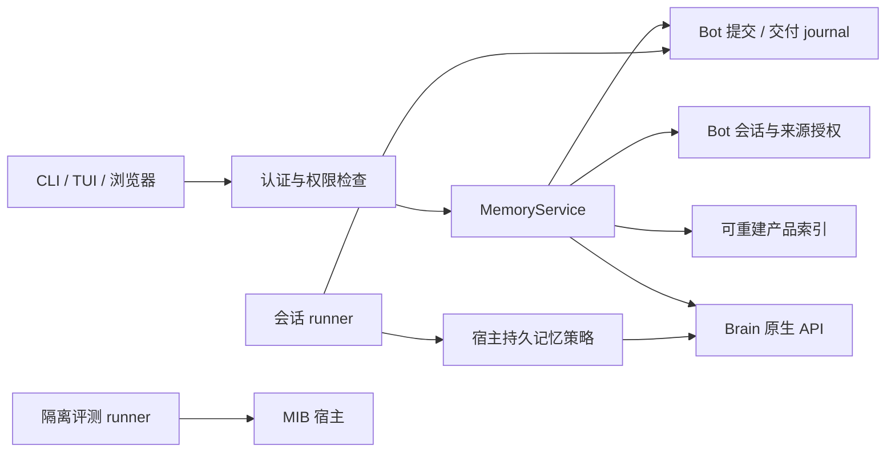

# Anda 记忆产品化：技术实施方案

- 实施状态：已交付本地实现与原生联调，验证和发行边界见[实施记录](memory-implementation-status.md)。下文保留原始目标合同，未发布的原生接口不代表当前 registry 版本已有该能力。
- 设计依据：[记忆产品设计](memory-product-design.md)。
- 代码基线：`cf2001b196586c7ac5e64170133aae4641a44155`，2026-09-22。
- 编写：Codex（OpenAI）。

本文将 P0–P5 拆成接口合同、存储改动、实施工作包及测试门槛。未指定其他方案时，开发按本文的默认决策执行；标为 **依赖门槛 G** 的能力在对用户开放前必须交付合同验证结果，不能用模拟成功状态上线。所有示例 ID、数据和指标均为设计示例。

## 1. 交付边界与实施顺序

| 版本 | 交付范围 | 允许对用户承诺 |
| --- | --- | --- |
| R0 / P0 | 普通记忆概览、离线指南、技术入口分层 | 能开始使用，知道服务和可选待办分别是否可达 |
| R1 / P1 | 按原对话关联的整理状态、重启后可查询 | 知道对应对话的处理结果；不承诺逐事实保存 |
| R2 / P2 | 有来源的记忆视图、更正、受执行约束的会话策略、删除 | 能核对和管理已支持范围内的记忆 |
| R3 / P3 | 按需设置持久待办、真实事项与稳定回复 | 确认问题可跨会话保留，回答结果可追踪 |
| R4 / P4 | 隔离评测 runner、预算说明、成对报告 | 在声明条件下比较记忆效果 |
| R5 / P5 | 受支持业务模板、独立观察、批准与回退 | 仅在明确业务边界内运行已经准备好的学习流程 |

R0 可以独立发布，但完整日常产品的完成门槛是 R2。R3–R5 不阻塞普通记忆；R4 可在隔离分支上与 R2 并行开发。本文只规划文档中的工作，不要求当前提交执行模型评测、修改生产配置或跨仓库提交代码。

## 2. 已核实的现状及必要依赖

| 实现位置 | 当前事实 | 设计约束 |
| --- | --- | --- |
| [runner.rs](../anda_bot/src/engine/agent/runner.rs) `submit_pending_formation` | 用历史窗口提交，过滤 action message，裁剪内容；失败退避 60 秒 | 原始窗口不是“提交了每条原文”的证明；展示需要保留具体映射 |
| [journal.rs](../anda_bot/src/brain/journal.rs) | `FormationSubmission` 没有 caller、路由和原消息映射；`RecallDelivery` 有 caller 和可选工具调用 ID | 不能直接将整个 journal 给前端；补来源元数据与授权投影 |
| [journal.rs](../anda_bot/src/brain/journal.rs) | 创建前占位；有 Brain ID 则查状态；无 ID 的不确定窗口不盲重发 | 产品不能加一个无条件“重试保存”按钮 |
| [instructions.rs](../anda_bot/src/engine/agent/instructions.rs) | 系统上下文读取 primer、user_info、Notes；user_info 是 get-or-init 路径 | 禁止记忆读取/写入必须早于系统指令构建，不止拦截 Recall |
| [meta.rs](../anda_bot/src/engine/agent/meta.rs)、[startup.rs](../anda_bot/src/engine/agent/startup.rs) | 会话 extra 保存 metadata，恢复时移除临时请求字段 | 持久策略必须保留；恢复不能重置为默认模式 |
| [conversation.rs](../anda_bot/src/engine/conversation.rs) | 会话读取检查 `conversation.user == caller` | 可复用会话授权；这不等于共享 Brain 图谱已有逐条 ACL |
| [engine.rs](../anda_bot/src/engine.rs) | 有 HTTP 身份校验、owner 身份、配置写锁与备份；一般认证辅助函数不检查 owner | 新管理端点需要显式 owner 检查，不直接沿用“认证过即可” |
| [browser_ws.rs](../anda_bot/src/engine/browser_ws.rs) | 验证 WS 调用者，Brain 调用保留原 bearer | 新 HTTP/WS 入口必须共享业务服务，不能借用 daemon token |
| [Inbox.svelte](../chrome-extension/src/lib/anda/brain/Inbox.svelte) | 发送前保存事件键和正文，再尝试投递 | 保留持久重试语义，补状态与错误展示，不重写为易丢失的请求 |
| [mib.rs](../anda_bot/src/mib.rs) | 两个协议、隔离进程内实验、累计成本；无完整计量、无 native learning 组 | runner、评分、预算是新增产品层，不修改能力布尔值冒充接线 |

### 依赖门槛

| ID | 必须证实的合同 | 阻塞范围 | 最小验证交付 |
| --- | --- | --- | --- |
| G1 | Brain 记录能返回稳定 ID、修订、来源与有效状态；来源能关联到 Bot 可授权的记录 | 来源卡片、逐事实保存证明 | 固定依赖版本下的 contract fixture；无来源/多来源/旧数据样例 |
| G2 | 可信原生更正支持条件更新、明确结果查询；明确是否支持调用幂等 | 精确更正、停用/删除 | 并发冲突、ACK 丢失、重启后结果查询测试；缺幂等时保留 unknown |
| G3 | 原生检索、索引、维护、再次 Formation 都遵守停用/删除及来源抑制 | “不再使用”“删除”上线 | 多来源派生、缓存、重建、重启和在途写入验证 |
| G4 | memory policy 可到达所有宿主注入点、可发现工具、子任务和恢复路径 | “不使用/不保存长期记忆” | 无网络模型 fixture 的 read/write 调用计数与绕过测试 |
| G5 | 受支持 Watch/Decision 的创建与撤销合同明确，只有 inbox adapter 不够 | 用户创建真实持久事项 | 最小事项从创建到回答/取消的 native 集成 fixture |
| G6 | 可约束和观测各模型阶段、重试及取消后的成本 | 一键实测、金额上限文案 | 部分计量报告；宣称金额上限前必须有完整计量和最坏预留验证 |
| G7 | executor / observer / source、固定摘要、校准和权限实际匹配 | 业务自动学习 | 独立服务探测及拒绝不匹配配置的测试 |

G1–G3/G5 的现有原生能力需要专项核实。本文的宿主接口是目标合同，不宣称 Brain 当前已有同名 API。若需上游改动，先提交明确的上游合同与测试，再使用 registry 发布版本接入；保留单一 DB/Core 类型身份，不为产品层另起一套图谱。

## 3. 技术结构与模块边界

新增一个较薄的 `MemoryService`，负责产品投影、能力判断和流程编排。Brain 继续拥有图谱、原生待办、Decision/Attempt/Outcome；Bot journal 继续拥有提交与交付关联。前端不拼接权限或修改状态真相。



建议文件划分如下，随对应阶段新增，不在 R0 建空框架：

| 文件（拟新增） | 职责 |
| --- | --- |
| `anda_bot/src/brain/product.rs` | DTO、能力与证据状态的纯映射；不调用模型 |
| `anda_bot/src/brain/service.rs` | `MemoryService`，组合现有 Client/Host、会话查询、索引 |
| `anda_bot/src/brain/activity.rs` | journal 元数据、活动投影、恢复与只读状态协调 |
| `anda_bot/src/brain/catalog.rs` | 经 G1 验证的原生记录到用户视图的转换 |
| `anda_bot/src/brain/mutation.rs` | 更正/删除预览、条件提交、结果对账 |
| `anda_bot/src/engine/memory_api.rs` | HTTP/WS 共用授权与请求分发，不注册为通用模型写工具 |
| `anda_bot/src/engine/agent/memory_policy.rs` | 会话策略的建立、继承和实际执行检查 |
| `anda_bot/src/cli/memory.rs` | 人类可读输出与稳定 JSON；不复制业务规则 |
| `chrome-extension/src/lib/anda/memory/` | 产品 API、状态 store、概览/活动/详情组件 |
| `anda_bot/src/mib/evaluator.rs`、`report.rs` | 显式隔离评测，不读取生产 home |

在 [engine.rs](../anda_bot/src/engine.rs) 组装同一 service 注入 HTTP 和 BrowserWebSocketState。沿用 [gateway/client.rs](../anda_bot/src/gateway/client.rs)、[service_worker.ts](../chrome-extension/src/service_worker.ts) 的传输方式；不要从 UI 回调调用模型工具来间接实现管理动作。

## 4. 身份、权限与传输合同

### 4.1 首版权限模型

- 新记忆总览、图谱记录视图、更正、删除、配置与评测控制先限 **local owner**。共享 `anda_bot` Space 尚不能据“有管理 token”就声称各用户的个人图谱隔离。
- 会话活动可支持非 owner 的已认证可信调用者，但必须先读 Bot conversation 并检查 `user == caller`，再返回该会话的记录。第一页先限制为指定 conversation；跨会话聚合仅 owner 开放。
- 原生 attention 仍由原 caller bearer 和 native principal 映射授权；owner 身份也不能替代 native recipient 权限。
- 外部 IM 用户不得访问 owner 记忆产品接口。校验来自宿主可信 channel 上下文的 `external_user`，保留 `(channel, reply_target, thread)`；请求体不能覆盖 caller/recipient/route。
- 匿名返回 401；已认证但无入口权限返回 403；按 ID 请求不属于自己的对象返回 404，避免暴露存在性。服务端在每个读/写/commit 阶段重查权限。
- HTTP 和 WS 都验证当前请求的凭证。WS 不能只使用握手时缓存的 caller 处理长期连接中的新管理请求；过期/失效时停止，不切匿名、不换 Bot token。可复用 `AppState::verify_user`，但须独立加入 owner 规则。

这只是新增产品入口的权限合同，不扩大或声称修复现有通用图谱接口的权限范围。R2 发布前还必须验证所有可用写路径遵守原生停用/删除规则，不能只限制新界面。

### 4.2 统一封装

新 HTTP 前缀：`/daemon/memory/v1`，与 Brain `/v1/{space_id}` 分开。HTTP 和 WS 共用 typed request/response；成功/失败沿用 Bot `ToolResponse` 的 `result/error/next_cursor`，不是 KIP 2.0。示例：

```json
{
  "result": {
    "schema_version": 1,
    "observed_at": 0,
    "memory": {"state": "reachable", "formation_active": false, "maintenance_active": false},
    "inbox": {"state": "not_configured", "visible_items": null, "inventory_complete": false},
    "capabilities": {
      "activity": {"state": "available", "reason": null},
      "records": {"state": "unsupported", "reason": "native_record_contract_missing"}
    }
  }
}
```

`observed_at` 使用 Unix 毫秒；传给 JavaScript 的 conversation/record/revision 等标识统一为字符串，避免 u64 精度损失。未知值用 null，不用 0、空数组或 false 冒充测量结果。所有分页结果区分 `complete`、`partial_reason` 和 `next_cursor`。

| HTTP（拟议） | WS method（拟议） | 阶段 / 行为 |
| --- | --- | --- |
| `GET /overview` | `memory_overview` | R0；两类状态并行读取，部分失败仍可返回完整诊断形状 |
| `GET /activity?conversation=...&cursor=...&limit=20` | `memory_activity` | R1；只读活动、按会话授权，不触发 Formation |
| `GET /records?cursor=...&limit=20` | `memory_records` | R2；有来源的结构化记录，不调用模型 |
| `GET /records/{id}` | `memory_record` | R2；详情与来源权限，ID 必须通过类型校验 |
| `POST /search` | `memory_search` | R2；显式自然语言 Recall，可能调用模型 |
| `POST /changes/prepare` | `memory_change_prepare` | R2；产生范围确定的更正/删除预览，不改变图谱 |
| `POST /changes/{operation_id}/commit` | `memory_change_commit` | R2；用户确认后的条件变更 |
| `GET /changes/{operation_id}` | `memory_change_status` | R2；只读结果和不确定状态；不重复提交 |
| `POST /inbox/setup/prepare`、`POST /inbox/setup/commit` | `memory_inbox_setup_prepare/commit` | R3；owner 配置事务，两步确认 |

WS 参数继续使用现有 tuple 数组风格：无参 `[]`，单 typed 对象 `[request]`，不另创序列化规则。浏览器只有在扩展 transport 不存在时才选择 HTTP；一次已发送请求失败不能自动改通道重发写操作。

请求使用 `deny_unknown_fields`，大小上限按端点设定：查询文本 8 KiB、变更正文 64 KiB、普通列表默认 20/最大 50 项。字符串按 UTF-8 字节校验；不得切割 JSON 或语义完整的 Recall 包。

### 4.3 错误及幂等

沿用 `ToolError` 的 `code/message/name/hint/data` 字段，在 `data` 中放 typed `reason`，包括 `unauthorized`、`forbidden`、`not_found`、`unsupported_capability`、`invalid_cursor`、`revision_conflict`、`acceptance_unknown`、`budget_exhausted`、`service_unavailable`。不新增与现有封装冲突的 `details` 字段。日志保留 request ID；UI 错误不输出 bearer、秘密、原始数据库路径或其他用户数据。

HTTP 错误映射固定为 400（参数）、401、403、404、409（游标/修订/幂等冲突）、413（体积）、429（容量/预算拒绝）、503（依赖不可用）、504（只读请求超时）。已接受但结果未知的变更返回 operation 状态，不能用 504 暗示安全重发。WS 使用对应 `ToolError`，客户端不得只按 transport 成功判断操作成功。

对新变更操作：`operation_id` 由客户端生成随机不可预测 ID，键空间为 `(caller, operation_id)`；宿主保存 canonical request digest。同键同正文返回同一逻辑结果，同键异文返回 409；网络中断后先查状态。此保证只覆盖宿主接受记录，不能凭宿主去重宣称原生副作用 exactly-once。

`prepare` 返回固定 target revision、preview digest、能力版本及 10 分钟有效期；`commit` 只接受 operation ID 和原 preview digest，不再次接收新的更正文案。过期或 revision 变化要求重新预览。commit 重试先读既有终态，再判断是否过期；已提交操作不因预览过期丢失查询与重试结果。

## 5. R0：概览与无额外配置的开始路径

### 5.1 服务 DTO

`MemoryOverview` 分开返回：

- `memory.state`: `reachable | unauthorized | unavailable | timeout`；服务可读不命名为“记忆健康”或“保存成功”。
- `memory.formation_active/maintenance_active`: 仅成功读取普通 `FormationStatus` 后赋值，否则 null。
- `inbox.state`: `available | not_configured | forbidden | unavailable | timeout`，必须由真实响应推导；403 不映射为未配置。
- `inbox.visible_items`: caller 可见的计数；不能推算全局 backlog，`inventory_complete=false` 需保留。
- `capabilities`: 活动、记录、变更、会话策略、持久待办、评测、learning 各自的 `available | not_configured | unsupported | forbidden` 及稳定 reason。仅编译 feature 不等于 available。

读取普通状态与 native runtime 状态并发，各 10 秒上限。完整超时不会卡住 TUI 事件循环：复用 pending task/channel 模式，在后台取结果，允许取消或退出。一次检查不启动 daemon、不调用模型、不执行维护、不写配置。

### 5.2 客户端合同

| 命令（拟议） | 行为 |
| --- | --- |
| `anda memory guide` | 解析参数后，在创建 home、读配置/identity/logger 前输出本地指南；退出 0 |
| `anda memory` / `anda memory status` | 相同只读概览；不自动启动 daemon；无现成身份时提示启动/初始化，不生成新身份 |
| `anda memory --json` / `anda memory status --json` | 输出同一个 versioned DTO；诊断写 stderr；普通状态不可用退出 1，只有 inbox 失败仍退出 0 |
| TUI `/memory`、裸 `/brain` | 展示概览；显式 `/brain inbox/status/formation/...` 保持行为 |
| TUI `/memory help` | 不发请求；普通聊天示例和模型费用/数据位置说明 |

`guide --json` 明确拒绝为参数错误，不静默忽略。`--home` 只对状态操作选用既有 home；guide 即使传入不存在的 home，也不创建它。图谱页面和设置保留原链接，首页迁移在 R2 进行。

R0 同步 `README.md`/`README_cn.md`、两组集成文档、配置模板注释和 SelfInstructions；docsite 修改时同步所有已有语言页面中的对应入口。模型不得因 runtime 未配置而建议普通用户先安装 MIB。

## 6. R1：可追踪的整理状态

### 6.1 扩展现有 journal，不改变真相来源

保留 `bot-brain/v1/formation/{conversation}/{window_start}` 和现有状态，给 `FormationSubmission` 添加 `#[serde(default)]` 的可选元数据：

| 字段 | 意义 |
| --- | --- |
| `provenance_version: Option<u32>` | 新格式为 1；旧记录为 None，不能隐式补成完整 |
| `caller: Option<String>` | 从可信会话创建上下文写入，与 `Conversation.user` 交叉校验 |
| `origin: Option<FormationOrigin>` | source/channel、reply_target、thread、external_user、归属主体；来自冻结的宿主元数据 |
| `source_messages: Vec<SourceMessageRef>` | Bot conversation、持久化消息 index、角色、内容摘要 digest；只引用实际纳入的消息 |
| `input_digest: Option<String>` | 对最终序列化 Formation 输入的 canonical digest，包含经处理的内容/context/timestamp |
| `updated_at: Option<u64>` | 最近一次实际状态查询/写入时间 |
| `failure_stage: Option<...>` | `submission_rejected | native_failed | interrupted | unknown`，防止 UI 将所有 failed 都视为可重试 |
| `policy_revision: Option<String>` | 提交时的有效会话策略；以后用于排除策略混淆 |

不在这些元数据中复制完整聊天、bearer、模型 key 或回复正文。新增字段需兼容旧 JSON；使用 fixture 验证旧记录可读。原生 conversation ID 仍是处理结果证据，宿主只转换展示，不修改原生状态。

**消息映射实施要求**：先在会话持久化成功后，以实际 durable conversation message index 建立引用，再做 action 过滤和内容裁剪。每个被提交片段携带与原记录的显式关联。历史压缩会换 conversation/偏移；仅相同字符串或全局 window offset 不能作为映射。如果现有生命周期不能保证稳定 index，在该工作包先持久化独立 message UID 并回填 UI 映射。歧义时 `source_messages` 不完整，活动只挂在对话级别，不挂错消息。

### 6.2 展示状态转换

| 原始情况 | 产品状态 | 可操作行为 |
| --- | --- | --- |
| 已可靠写 journal，尚在本次提交调用中 | `submitting` / 等待整理 | 无需阻塞聊天 |
| 有 ID、native Submitted | `accepted` / 等待后台整理 | 查状态 |
| native Working/Idle | `processing` / 正在整理 | 查状态 |
| native Completed | `completed` / 对话整理完成 | 查看关联记录；无 G1 证据不展示逐事实保存 |
| 明确提交拒绝、没有 ID | `rejected` / 提交失败 | runner 原有退避路径；R1 不新增手动发送接口 |
| native Failed/Cancelled，有 ID | `failed` / 整理未完成 | 查看原因；不自动复制成新任务 |
| 传输丢失/崩溃后 Pending 且无 ID | `unknown` / 正在确认结果 | 只对账，不重发 |
| 旧记录缺少可靠元数据 | `legacy_unattributed` / 历史处理记录 | owner 对话级诊断，不伪造消息或事实证明 |

“等待整理”不意味着已经有完整可恢复 outbox；R1 不新增自动重放能力。unknown 可恢复为 accepted/failed 的前提是获得可验证的原生关联证据。没有服务端幂等键或可查的提交关联时，保持 unknown，并提供技术详情；不以超时阈值改成 failed 后重发。

### 6.3 活动投影与协调 worker

新增 AndaDB 集合 `bot_memory_activity_v1`，schema v1，沿用 BookmarkStore/CronStore 的 typed schema、BTree index 和 flush 方式。字段：`_id`、`user`、`conversation`、`journal_key`、`kind`、`observed_state`、`submitted_at`、`updated_at`、`native_id`、`provenance_complete`。索引至少覆盖 user、conversation、journal_key；业务唯一键为 journal_key，更新使用宿主串行锁，不能假设普通 BTree 是唯一约束。

该集合仅为可重建索引。写入顺序为 journal → 投影，投影失败不改变已接受的 Formation；读取命中索引后仍核对 journal 和会话授权。启动时用分批 journal 扫描修补索引，checkpoint 用版本化对象键保存；未完成时返回 `complete=false`，不能把部分数据当全量。旧记录仅在现有会话 ownership 可证实时归属，否则不向普通用户展示。

列表用 `_id` 做稳定 keyset pagination，保留首屏 upper bound；按 caller/filters 绑定游标，服务器始终重新应用权限过滤。游标只影响遍历，不携带授权；无效或不匹配的游标返回 409。新写入在下一次刷新首屏出现；行状态允许更新，不承诺快照事务。R1 展示的是活动插入顺序，不能称为按真实事实更新时间排序。

worker 在 Brain runtime 安装并加载 Space 后、复用 gateway 生命周期启动，独立于 LLM idle hook。只轮询有 native ID 的非终态任务；建议初值每批 20、并发 4、活跃间隔 5 秒、退避到 60 秒。查询失败保留旧状态，记录 `last_checked_at`/`stale=true`，不改成终态。停止时取消任务并 flush；每个记录单写者，防止 completed 被迟到的 processing 覆盖。

Recall 活动复用 `RecallDelivery`，展示“已检索到相关记忆”或失败。没有唯一 tool_call 关联时只展示在对话活动里；不得为相同并行调用猜测对应关系，不追加记忆包内容绕过 Recall budget。

## 7. R2：有来源的记忆视图与更正

### 7.1 原生读取 adapter 与可见范围

在 G1 通过后实现 `MemoryCatalog`，其语义接口为 `list_records`、`get_record`、`get_sources`、`records_for_formation`。这是拟议宿主 trait，不是现有 Brain 函数名。后端使用经固定版本验证的 typed native API 或有参数绑定的只读 KIP；不解析模型自然语言来制造结构化记录。

`MemoryRecordView` 至少包含：

| 字段 | 规则 |
| --- | --- |
| `id`, `revision` | 来源于原生稳定身份/修订，不用正文 hash 代替身份 |
| `text`, `kind` | 人类可读文本；kind 为 preference/project/fact/other 的产品分类，未知归 other |
| `scope` | 人物/项目/时间范围；未知为 null，不默认“所有人/永久” |
| `effective_at`, `updated_at` | 能证实才赋值；不拿抓取时间冒充事实变更时间 |
| `state` | current/superseded/suppressed/unknown，由原生语义推导 |
| `sources[]`, `sources_complete` | 原生引用 + 可授权的 Bot message ref；旧数据可以不完整 |
| `allowed_actions[]` | 服务端权限与原生能力共同决定，每次执行仍再验证 |

混合来源记录：不能因为其中一条来源属于 caller 就暴露其他来源或整条复合推断。首版 owner-only；未来支持其他主体前必须定义记录 ACL 与派生授权合同。授权失败的数据在服务端过滤，计数/分页同样不能泄漏。

自然语言 `/search` 明示可能调用模型，使用现有完整 Recall packet 和覆盖警告。请求只接受 `query` 与 typed `budget`，caller/context 的归属字段由宿主确定；产品入口建议默认 packet 4096、normalized planner context 32768，采用 Brain 固定 tokenizer 并经原生 validator 校验。这两个值是局部上限，不是完整费用预算；显式修改预算仍需校验，不能因不支持而回退为无界调用。

该 POST 不自动重试；断线提示检索结果未知，只有用户再次发起才重新执行，并说明可能重复计费。状态刷新不触发搜索。搜索答案与 `MemoryRecordView` 分开：没有原生记录引用就只能展示答案，不能制造可编辑卡片。选择“用于当前任务”只注入用户选中的授权内容和出处，记录 `selected_by_user`，不将该操作解释为独立贡献证据或执行授权。

### 7.2 更正事务

prepare 输入：`operation_id`、`record_id`、`expected_revision`、`new_text`、明确 scope、生效时间。自然语言先生成可编辑草稿；服务器接受的是用户确认的 typed 变更，不执行模型输出的 KIP。

处理顺序：授权 → 验证 G2 和 schema → 读取记录/来源 → 生成固定 preview → 持久化 prepared receipt。commit：重查权限/修订/preview → 持久化 committing → 调原生条件写入 → 保存 native receipt → 再读记录确认 → 返回 confirmed。

操作记录放 `bot-brain/product/v1/changes/{caller_hash}/{operation_id}`，`PutMode::Create` 抢占；更新带版本条件或由单写者管理。禁止“先调用原生再写操作记录”。网络不确定时写 unknown；有 native operation ID 则只查结果。若原生无幂等/可查询结果，人工核对前不重试 commit，能力不得宣称完全可恢复。

记录包含 operation/request/preview digest、目标 revision、caller、阶段、native receipt、时间和脱敏错误。prepared 阶段的更正文案确有需要时仅存本地，沿用现有私有数据存储权限；完成后按保留策略删除多余副本。不能新增包含更正文案的全局诊断日志。

原生写入成功但投影刷新失败：返回原生已确认与“列表更新中”，不能假装整个更正失败后再发。undo 使用新的有条件变更，不能覆盖期间出现的新修订。自然语言聊天纠正保持现有新信息提交路径，文案为“提交更正信息”，与此精准变更流程区分。

### 7.3 前端与 TUI

浏览器默认进入“记忆”概览，原图谱作为“探索关系”保留；`DashboardApp.svelte` 的现有工作区兼容旧 hash。`ChatMessageItem.svelte` 的状态只读宿主 activity，不解析 assistant 内容。模型回复完成和记忆整理完成使用独立状态源。

新 memory store 的 identity key 绑定 gateway、space、已验证 caller；凭证切换时立即清空数据、取消请求，迟到响应按 identity generation 丢弃。切勿缓存其他主体的预览/来源。轮询只在相关界面可见且有非终态活动时进行，建议 5 秒，退避到 60 秒；隐藏、退出、断连后停止。

TUI `/memory` 扩展为概览；`/memory activity` 列当前会话活动。记录详情、更正和删除走同一服务；操作可以先由浏览器交付，TUI 明确显示支持范围，不将复杂 JSON 当普通用户交互。新增文案进入现有 locale 文件，所有已有语言具备同样的 key。

## 8. R2：受宿主约束的会话记忆策略

### 8.1 固定三种模式

| 模式（拟议） | UI 名称 | 自动读取 Brain/Notes | 自动写入 Brain/Notes |
| --- | --- | --- | --- |
| `standard` | 正常使用记忆 | 允许，沿用既有授权 | 允许，沿用异步 Formation |
| `no_store` | 本次不保存长期记忆 | 允许 | 禁止，包括 get-or-init 和隐式迁移写入 |
| `off` | 本次不使用长期记忆 | 禁止 | 禁止 |

范围是宿主管理的 Brain/Notes 记忆，不意味着聊天、文件、日志、浏览器或模型服务无痕，也不能限制拥有文件读取权限的用户自行查看文件。UI 在选择处说明这些边界，不宣称对拥有任意 shell 权限的会话提供数据隔离沙箱。

模式在新会话第一条消息创建前确定。当前会话已有上下文时，切换到更严格模式通过新建空会话完成，不自动复制旧摘要/记忆/答案。已有模式更改请求返回“创建新会话”或 409；不实现含糊的半个 turn 边界。已提交的旧会话工作照其原策略处理，用户需单独管理已有记忆。

### 8.2 持久化与执行

新增 typed `MemoryPolicy { version: 1, mode, revision, created_at }`，由授权 CLI/browser 的新会话控制输入构造，写入 `Conversation.extra` 中的独立版本化字段；在 Session 中保存不可变副本。允许用户选择更严格模式，但模型 tool args、普通内容、外部 channel metadata 不可覆盖。默认缺字段的旧会话是 standard；未知 version/mode 必须拒绝启动该会话，不回退为 standard。

必须覆盖以下路径，G4 的 fixture 对每项记录实际调用次数：

1. 初始/恢复/压缩后 `build_system_instructions_for_user`：off 不调用 primer、user_info、Notes；no_store 使用只读 profile 查询，不调用 get-or-init 或 legacy Notes 写迁移。只读接口不存在时先补齐或返回能力不可用。
2. `recall_memory`、Brain 相关 tools、动态 tools_select、Notes 工具：既限制可见名称，又在调用执行前检查有效 policy；不能靠隐藏 schema 防绕过。
3. `submit_pending_formation` 的所有路径：正常回复、idle、stop、后台完成、goal、compaction、启动恢复。no_store/off 跳过整个写入窗口并保留宿主策略记录，不留下以后可误重放的待提交窗口。
4. 子任务、side task 与后台回调继承父策略；子任务不能放宽。混合来源合并时采用最严格读写约束，并保留来源标签；策略不能证明时拒绝自动持久化。
5. 被排除会话的摘要、工具结果、自动书签摘要及后续批量记忆导入不得绕过排除；所有宿主自动记忆写入入口检查来源排除标记。用户手动复制重述的文本不是系统能可靠识别的同一来源，产品不承诺阻止这种再输入。
6. 现有独立 cron 不因某次临时会话而变更；从受限会话新建并携带其内容的计划任务必须持久继承策略，显式拒绝不支持的路径，不能默默 standard。维持原 reply_target/thread。

建议统一在 Brain/Notes 执行封装层检查 policy，并在会话入口校验，避免每个工具各自解释字符串。Notes 属于 Engine dependency 的路径要通过 hook/wrapper 验证有效拦截；缺宿主钩子时列为上游依赖，未覆盖前不开放模式按钮。

## 9. R2：停用、删除与防止后台恢复

区分 `suppress`（保留但不参与后续自动使用）与 `delete`（移除声明范围内的图谱内容）。两者都走第 7 节 preview/commit，不直接调用宽泛删除 KIP。

prepare 必须给出：目标记录/修订、来源、派生项、影响范围、是否可恢复，以及不处理的聊天/附件/日志/备份/服务商数据。G3 不完整时该动作返回 unsupported，UI 不能只隐藏卡片后显示删除完成。

建议原生操作状态：`prepared → blocking_reuse → applying → verifying → completed`；任意失联进入 unknown 或保留当前阶段。先持久化 reuse suppression，再修改图谱/索引，最后验证；不能先删来源证明，导致后续无法抑制重建。

防复活要在 Brain 原生写入/维护与 Recall 边界实现：

- tombstone 至少绑定 space 实例、稳定 source identity/record identity 和原生 revision；不用“正文等于某字符串”作为唯一规则。
- 与 Formation/maintenance 的在途写入建立串行化或版本 fence。旧请求后来提交时须检查 suppression；无法覆盖所有入口则保持能力不可用。
- 失效所有相关检索缓存、原生 materialized record 及宿主目录缓存；已打开页面收到 revision 变化后刷新。已交付给活动模型的内容不能撤回，UI 明示仅约束后续自动读取。
- 多来源事实不能只删一个来源就宣称整条事实已消失；预览明确是删除某条来源、整个事实还是整个派生集合。
- 已备份的数据可能恢复旧内容。恢复工具必须携带当前 tombstone 或明确要求重新验证；旧备份直接覆盖 DB 不在“删除后仍受保护”的保证内。

tombstone 以最小标识和必要摘要保存，不保留被删除全文；最小复活防护元数据的保留和彻底擦除之间的取舍必须在删除范围中说明。后台重建/恢复测试通过后，才开放对应动作。

## 10. R3：持久待办配置与回答

### 10.1 setup 事务

prepare 只读取已存在的 owner 身份，生成最小 `attention_inbox_v1` 配置差异。原生 principal 可使用稳定 owner 标识映射，但不要将所有 managers 配到同一个 recipient。不给 observer、audit_recipients、manage_trust、learning 或 shell 权限。

检查 `BRAIN_RUNTIME_CONFIG` 优先级、自定义 runtime 文件、当前配置内容摘要。环境覆盖无法由向导可靠修改时返回 `external_config_override`，展示实际生效来源与手动合并步骤。自定义文件不无提示重写。

commit 复用配置写锁/私有文件权限/原子替换；先写新的受管 runtime 文件，再切换 config 引用，旧文件保留备份。不能声称两个文件的 rename 是一个事务：用 prepare/applying/applied/restart_required journal 记录阶段，启动时按实际文件摘要对账。进程在任意一步崩溃时，恢复到可解析的旧配置或完整新配置，不产生半份 YAML。

静态原生校验不触发 Space 加载和授权写入；真正安装在重启后的首次 Space load 前进行。启动失败保留日志与恢复入口，禁止吞错后临时用无配置模式假成功。文件回滚不等于撤销已安装 native grants；需要 native 撤销时单独展示并执行，重启不会恢复用户已撤销 grant。

返回 `restart_required` 并说明影响；用户显式触发重启。在线验证 native mapping 和 inbox 可读后才显示 configured；没有事项就是“暂无事项”，不生成未标记演示数据。

### 10.2 事项与回答

G5 通过后只开放经过校验的事项模板，普通即时澄清直接在聊天里问。不得把自由文本“帮我留意”直接转换为任意 Watch、cron 或 full-access goal。

现有 browser inbox 保留 event_key + 原正文的先存后发；TUI 使用既有私有存储增加同等 outbox，键至少含 gateway/space/caller/item，秘密凭证不落盘。账号变化只展示该身份的 pending。

答案状态：`draft → pending → acknowledged`，断线保持 pending；重试必须原 key 原文。409 显示冲突并查询原收据；事项过期/关闭显示原因，不生成新 key 偷偷提交另一回答。存储失败时不发送，以免无法满足可恢复承诺。acknowledged 只表示回答被接受，不能改写 native task 状态为成功。

## 11. R4：隔离的 MIB 评测产品

### 11.1 命令与执行位置

拟新增 `anda memory evaluate plan/run/report`，由 `mib` feature 提供；现有 `anda mib` 保持兼容。evaluate 路径在 `main.rs` 的生产 home/identity/daemon 初始化前分发，拒绝 `--home`。显式传入 model-config、API-key-env、输出目录，不能默认读取生产模型密钥或用户记忆。

- `plan`：读取非秘密模型标识和冻结模板，输出 versioned plan，零模型调用；包含 Track、case IDs、arms、重复次数、顺序种子、已能保证的边界、未知费用项、配置摘要。
- `run --plan <file> --output <directory>`：校验 plan digest 和能力后，由用户显式发起；先保存 run manifest，再启动隔离宿主/客户端。已存在的结果目录不覆盖。
- `report <directory>`：只用现有记录重建报告，不调用模型、不重新运行失败样例。

开发阶段先实现 CLI，浏览器仅在服务端能力可用后展示启动入口。正式二进制不含 feature 时解释“该构建不含评测组件”，不引导普通记忆用户重新编译。

### 11.2 冻结协议流程

每次 run 固定 plan/model/prompt/tools/dataset/scoring/budget 摘要以及 host epoch。每个 `(case, repeat, arm)` 使用独立 run ID，且 Track A/B 命名空间分别管理。

执行顺序：describe → 校验协议与能力 → reset → observe 学习阶段记录 → 等待实际 Formation 完成 → 按协议进行 maintain/session_boundary → respond 或 retrieve+固定业务 agent → 按任务执行受限工具并 observe 工具结果 → 固定 scorer → close。

Track A 的业务 agent/model/prompt/tools 完全由 runner 固定；Track B 只评估现有有界 agent 适配器。每对输入与工具环境保持一致，无记忆组保留同一任务必要工具响应，不能把 no_memory 做成无工具/无上下文组。评分材料在任务结束前不进入被测输入；audit 输出不得通过 observe 回灌。

HTTP 不确定时用同 request ID/同正文查询或重试；宿主断连不意味着任务停止。Ctrl+C 执行 close 并记录清理结果；超时后仍可能在处理的工作标记 unknown，不偷偷新开同 case 重跑。host epoch 变化使受影响成对试验无效；新评测分配新的 evaluation ID，不混合旧 epoch 的结果。

默认仅支持 `persistent` 与 `no_memory`；描述符不支持 normal/ungated 时在任何模型调用之前拒绝。机制 fixture、人工体验、正式效果评测分别标注 `evidence_kind`，不能混作一个成绩。

### 11.3 预算与报告数据

计划必须包含 `max_cases`、`max_protocol_operations`、操作 deadline、evaluation deadline、各阶段可施加的 token 上限和最大并发；建议首版并发 1。协议操作数不是内部 provider 调用数。当前无法覆盖的后台模型重试明确列入 `unmeasured_stages`。局部上限只按其实际范围命名，不能直接相加成保证的总预算。

G6 分两档验收：第一档证明实际可控的协议/时间边界并完整披露缺测，允许显式发起的高级实验；第二档覆盖所有模型阶段与价格，才可发布硬金额上限。没有第一档证据不开放实测按钮，只有第一档时界面不得宣称第二档保证。

G6 完整后，为每次 provider 请求增加共享 ledger 的原子 reserve → settle，未知请求保留预留，不按 0 释放。重试、Formation、Recall、Maintenance、业务 agent 和 observer 均计入；取消后仍可能结算的调用保留状态。未知 provider 价格或无法限制的内部调用使 `hard_currency_cap_supported=false`，可拒绝要求硬金额上限的计划。

输出目录（用户明确指定，内容不得包含密钥）包括：

```text
plan.json                  # 冻结计划及摘要
manifest.json              # evaluation ID、版本、启动/结束与清理状态
events.jsonl               # 请求身份、阶段、收据及错误；不记 Authorization
cases/<case-run-id>.json    # arm、结果、评分、最新成本快照及覆盖说明
report.json                # versioned 结构化报告
report.md                  # 从同一 report.json 生成的人类可读报告
```

报告必备字段：planned/completed/invalid/cancelled/unknown 数量、有效配对数、各指标分母、逐 case 对照、native capability 快照、已测成本、未测阶段、清理结果、证据类别。每个原生 run 的成本仅取最后累计快照；不同 run 才能求和。失败响应中存在测量也保留；无最终快照时标记不完整。

冻结初始合成模板覆盖偏好保持、更新覆盖、同名区分、缺信息时 abstain。机制测试只需小 fixture；真实样本数与重复次数由计划明确批准。先报告观察到的成对差值，不在少量样例上宣称提升。若要报告统计区间，另固定分析方案、按 case 聚类处理重复运行并保存分析配置；没有通过该门槛时 `uncertainty.status=not_estimated`，不编造置信度。

## 12. R5：业务学习模板与准备度

基于现有 `workflow_http_v1`，只支持当前合同中的 `tool_workflow.precondition.v1`。新增模板描述文件固定任务族、executor/observer/source 合同与版本、工具限制、预算、校准要求、回退方法；它是可信部署资产，不从普通记忆或模型回答安装。

准备度按阶段返回 `not_compiled / services_missing / identity_mismatch / calibration_missing / awaiting_approval / ready`，以及可执行的下一步。G7 必须证明 executor 和 observer 分离且身份匹配、source cohort 冻结、所有摘要一致；启动探测服务须已监听，不回调尚未启动的 Bot gateway。

隔离试验授权与业务应用授权分开保存；默认不开自动 trials/reviews/archive/safety。只有显式部署批准才能启用对应自动项。收据、用户点赞、业务 agent 自述都不能注册为独立 Outcome；普通模型没有设 trust 或安装 observer 的 API。

失败/撤销由原生安全恢复处理并显示结果；未撤销完毕展示未完成状态。P4 persistent 的评测报告不能直接当作这一任务族的 calibrated normal-learning 证据。

## 13. 可逐个提交的工作包

每个工作包对应一个可审阅 PR 或一个明确的上游依赖交付。下表不意味着当前创建 issue/PR；开发时按 ID 引用，未完成项保持未勾选。W 编号表示前置工作包；G 编号表示该工作包完成/开放能力的验收门槛，可由本包连同上游工作交付，不形成“必须先完成自己才能开工”的依赖。

| ID | 依赖 | 具体交付 | 完成条件 |
| --- | --- | --- | --- |
| W00 | 无 | 固定 DTO/error/capability schema、owner/会话授权函数；新增 `memory_api.rs` 的合同 fixture | HTTP/WS 同一语义；匿名/非 owner/伪造 caller 拒绝 |
| W01 | W00 | `product.rs`/`service.rs` 普通状态与 runtime 独立读取 | 超时/403/空图谱区分；模型调用计数为 0 |
| W02 | W01 | CLI/TUI 离线指南和概览；双语及既有 locale 文档入口 | guide 无文件/身份副作用；TUI 不阻塞；显式 `/brain` 子命令兼容；R0 可发布 |
| W03 | W00 | 核查 G1–G3/G5，提交 native 能力矩阵、样例与精确上游缺口 | 每项 available/needs-upstream 明确，不留“前端以后猜” |
| W04 | W00 | journal provenance、实际消息映射、legacy reader | 过滤/裁剪/compaction/路由样例映射正确；歧义只挂对话级 |
| W05 | W04 | 活动索引、分页、恢复 worker、activity API | 崩溃恢复/部分索引/迟到响应不篡改真相；不重放 unknown |
| W06 | W02、W05 | 对话旁状态和 TUI activity；账号切换/错误文案 | native Completed 无提取证据时只显示整理完成；R1 可发布 |
| W07 | W03、G1 | 原生 catalog adapter、来源授权、记录 DTO | 旧数据、多来源、修订与无来源结果均有合同 fixture |
| W08 | W01、W07 | 记忆首页/详情/搜索、旧图谱入口、来源导航 | 查询不伪造记录；跨身份缓存隔离；窄屏与读屏可用 |
| W09 | W03、G2 | prepare/commit/status 操作账本和条件写入 adapter | 并发修订冲突；同 key 异文拒绝；ACK 丢失不重复副作用 |
| W10 | W08、W09 | 明确范围的更正交互、结果投影与 undo 新操作 | 用户确认内容与 native 变更一致；投影失败不再次改写 |
| W11 | W04、G4 | typed 会话策略及所有读取/写入/恢复继承路径 | off/no_store fixture 中禁止调用为 0；旧会话兼容、未知模式拒绝 |
| W12 | W09、W11、G3 | suppress/delete 预览、原生 fence、缓存与防复活 | 在途 Formation、维护、重建、恢复后仍满足删除范围 |
| W13 | W06、W08、W10–W12 | R2 集成验证、隐私范围文案、迁移/回滚演练 | 第 14 节全部 R2 门槛通过；可用性试验另列结果 |
| W14 | W00、W03、G5 | setup 配置事务与受支持事项模板 | 环境覆盖/既有配置/重启失败可恢复；不给额外 grant |
| W15 | W14 | 复用 browser pending、TUI outbox、回答状态 | 同事件原文重试；换账号与 item 关闭测试；R3 可发布 |
| W16 | W00 | 隔离 evaluate plan/run/report、协议状态机与模板 | 机制 fixture 全流程；生产 home/identity/IM/cron 从未初始化 |
| W17 | W16、G6 | 阶段预算、计量覆盖、报告与取消清理 | 累计成本不重复、未知不算零；实测需单独批准；R4 可发布 |
| W18 | W14、W17、G7 | 学习模板准备度、隔离试验与业务授权/回退 | 原生服务与独立证据全接通，错误配置拒绝；R5 可发布 |

默认执行队列：W00 → W01 → W02；随后 W03 与 W04，推进 W05/W06 和 W07–W12；W13 才是完整日常记忆版本验收。不要因为上游 G2/G3 暂未满足而把只有入口的版本标记为 R2 完成。

## 14. 测试矩阵与验证命令

优先新增能反映用户承诺的行为测试，使用本地 fixture/mock provider；不为纯文案编写镜像测试。模型调用次数和原生请求次数需可计数，便于证明只读/受限模式没有额外调用。

| 编号 | 关键场景 | 门槛 |
| --- | --- | --- |
| A01 | guide 使用不存在 home、未配置模型/身份 | 退出 0，无新增目录，无网络 |
| A02 | 普通状态成功，runtime 403/timeout/not-configured 分别返回 | 普通状态保留；三类 runtime 原因不混同 |
| A03 | JSON 同时含 error 与 partial result | 仍为错误，不展示 ready/空记忆 |
| A04 | HTTP/WS caller 过期、非 owner、跨 conversation、external sender | 一致拒绝，不借用 daemon 身份，不泄漏计数 |
| A05 | durable message 经 action 过滤、裁剪、压缩切链 | activity 只关联可证实的原消息 |
| A06 | journal 写完/原生接受/投影写入各点崩溃 | 原生已接受内容不重复发送；索引可重建 |
| A07 | 重启后的 Pending 无 native ID、并行相同 Recall | unknown 不重发；Recall 不猜 tool-call 归属 |
| A08 | native Completed 但未产出目标事实 | 只显示对话整理完成 |
| A09 | 翻页期间新增/删除记录、权限撤销、旧游标换 caller | 无跨用户数据；partial/游标语义一致 |
| A10 | 两个客户端同时更正同一 revision；ACK 丢失后重试 | 一次可确认更正，其余 conflict/unknown；无盲目重做 |
| A11 | off/no_store 的初始、恢复、compaction、tools_select、Notes、子任务、cron 派生 | 禁止的 read/write 为 0；metadata 不能放宽策略 |
| A12 | 删除遇到在途写入、旧来源重放、多来源派生、缓存/备份恢复 | 与声明范围一致；不满足即不开放该动作 |
| A13 | setup 两文件写入各点中断、环境覆盖、自定义配置、撤销授权后重启 | 配置可恢复且授权不升级 |
| A14 | inbox 请求发送后断线、页面重载、local storage 失败、换账号、同键异文 | 原 key 原文恢复；存储失败不发送；不跨身份 |
| A15 | MIB reset/observe/maintain/close 失败、host epoch 改变、Ctrl+C | 清理与无效样例完整记录，生产状态不触碰 |
| A16 | 多条累计成本快照、失败后费用未知、provider 重试、预算并发 | 不重复累加、不漏标缺测、不误报金额上限 |
| A17 | learning feature 存在但服务/校准/身份缺失 | 不能启动自动学习，不能改 descriptor 冒充支持 |
| A18 | 浏览器旧连接、旧版本 backend、窄屏/键盘/读屏、全部 locale | 无支持能力明确说明；可完成已开放流程 |

Rust 命令必须保留栈设置。以下是实施后的验证菜单，按工作包运行；本次仅文档提交不执行这些未来测试：

```bash
cargo fmt --check
env -u LIBRARY_PATH RUST_MIN_STACK=16777216 cargo test -p anda_bot brain:: -- --nocapture
env -u LIBRARY_PATH RUST_MIN_STACK=16777216 cargo test -p anda_bot memory_ -- --nocapture
env -u LIBRARY_PATH RUST_MIN_STACK=16777216 cargo test -p anda_bot tui:: -- --nocapture
env -u LIBRARY_PATH RUST_MIN_STACK=16777216 cargo test -p anda_bot external_user -- --nocapture
env -u LIBRARY_PATH RUST_MIN_STACK=16777216 cargo test -p anda_bot wechat_thread -- --nocapture
env -u LIBRARY_PATH RUST_MIN_STACK=16777216 cargo test -p anda_bot --features mib mib:: -- --nocapture
env -u LIBRARY_PATH RUST_MIN_STACK=16777216 cargo test -p anda_bot --features mib,learning brain:: -- --nocapture
cargo clippy --all-targets --all-features -- -D warnings
pnpm --dir chrome-extension check
pnpm --dir chrome-extension test
pnpm --dir chrome-extension i18n
pnpm --dir chrome-extension build
```

`memory_` 是建议的新测试命名前缀；检查实际 executed test 数，0 个测试不算通过。若修改 docsite，再运行 typecheck/build。机制 fixture 使用合成数据和本地模型实现；真实 provider 对比不进默认 CI，也不把 fixture 结果写成用户效果证据。

## 15. 迁移、运维和发布纪律

1. **增量存储**：R1 journal 新字段缺省兼容；索引独立 schema/version，可删后重建。升级先处理版本与索引，再提供新 API；来源无法补齐时保留不完整状态，不阻塞普通旧数据读取。
2. **策略与删除不可静默降级**：R2 新宿主读到未知策略版本失败关闭相关会话；旧二进制可能忽略新策略/tombstone，不能假设写一个最低版本标记就能阻止旧程序运行。发布说明明确 R2 之后不能直接降级继续处理受限数据；回滚需停止服务、使用兼容版本，或在用户理解数据影响后恢复升级前备份。
3. **前后端兼容**：客户端先查能力与 schema，旧服务 404 表示此产品 API 不支持；可回到明确标识的旧图谱/技术入口，不伪装空记忆。HTTP/WS 新方法不改变既有 KIP 和 application-tool 封装。
4. **观测**：只记录 operation ID、阶段、耗时、状态码、版本与计量覆盖；默认本地。可导出的诊断先去正文、凭证和其他主体信息。R1 unknown backlog 显示真实数量/覆盖范围，不触发模型自修复。
5. **资源约束**：状态协调与投影重建分批、有取消、启动不做无限全量扫描。负载基准至少覆盖空库、1 万活动、旧数据和断连；容量不足返回明确错误，不清掉未解决的 unknown 记录来腾空间。
6. **清理策略**：journal 是审计与对账材料，不随 UI 已读清除。resolved 活动可按后续保留策略归档；pending/unknown、删除 suppression 和未结算费用不得在仍需保证期间清理。前端退出清空内存缓存，持久 pending 仅在有收据/用户明确处理后清除。
7. **发布门槛**：每个 PR 写明覆盖的 W/A/G 编号与尚未通过的门槛。README、产品文案和 capabilities 只暴露已交付能力。R2/R4/R5 用独立验收记录，不能因为依赖编译成功而宣称完成。

## 16. 开工清单与文档验收

- [ ] 从基线复核模块路径、依赖版本与未提交变更；不覆盖其他工作。
- [ ] 将 W00 的数据形状和 owner 边界固定为 fixtures，再推进 W01。
- [ ] 先完成并审阅 R0；W03 出具原生依赖矩阵后，继续 P1/P2。
- [ ] 每个工作包保留对应 A 测试结果和 G 合同证据。
- [ ] 收齐 R2 的状态、来源、更正、策略和删除证据后，再标记日常产品化完成。

本文交付验收：本地引用存在、示例结构一致、工作包依赖无环、现有和拟议能力分离，未变更任何运行代码。产品方案负责“为什么和用户如何使用”，本文件负责“在哪改、按什么合同改、怎样证明改对了”。

---

署名：**Codex（OpenAI）** · 2026-09-22
